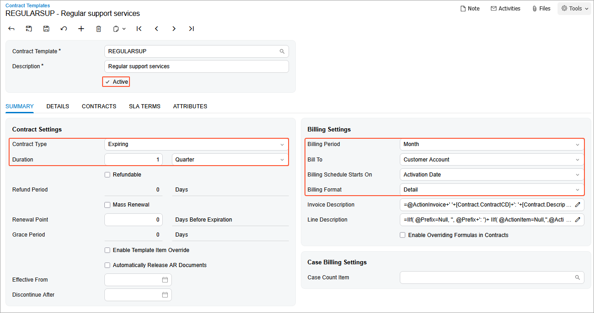

# Contract Template Creation: To Create an Empty Support Contract Template {#_81734501-253a-4b22-a2b7-aadc682b7cea .task}

In this activity, you will learn how to create an empty template for a support contract.

**Attention:** This activity is based on the *U100* dataset. If you are using another dataset or if any system settings have been changed in *U100*, these changes can affect the workflow of the activity and the results of the processing. To avoid issues, restore the *U100* dataset to its initial state.

## Story { .section}

Suppose that the SweetLife Fruits &amp; Jams company, in addition to deploying juicers, also specializes in providing maintenance. The Unifruit LLC customer previously purchased juicers and now needs to enter into a maintenance support contract. On *3/8/2026*, the support contract was signed by both parties.

According to the terms of the contract, it has the *Expiring* type, and the contract span is three months. On *3/10/2026*, the service under the contract was provided by one regular specialist for four hours for a total sum of $480. This service was reflected in the system in a separate case.

The service of maintenance specialists costs $120 per hour, and the price is not dependent on the skills and position of the employee performing the service. The billing of the contract will be performed monthly and on a per-case basis.

Acting as a sales manager, you will create an empty contract template for the support contract.

## Process Overview { .section}

On the [Contract Templates](CT_20_20_00.md) \(CT202000\) form, you will create an empty template for a support contract.

## Configuration Overview { .section}

In the *U100* dataset, the following tasks have been performed to support this activity:

-   On the [Enable/Disable Features](CS_10_00_00.md) \(CS100000\) form, the *Contract Management* feature has been enabled.
-   On the [Customers](AR_30_30_00.md) \(AR303000\) form, the *UNIFRUIT \(Unifruit LLC\)* customer has been created.

## System Preparation { .section}

To prepare to perform the instructions of this activity, do the following:

1.  As a prerequisite to this activity, complete the [Contract Configuration: To Create Entities for a Support Contract](config_Contract_Management_Implem_Activity_To_Configure_Labor_Items_for_Support_Contract.md) to create a labor item and a new case class for the support services you will use during the creation of the empty contract template.
2.  Launch the Acumatica ERP website with the *U100* dataset preloaded, and sign in as the sales manager David Chubb by using the *chubb* username and the *123* password.

## Step: Creating an Empty Contract Template {#section_wjg_5zs_dtb .section}

Now you need to create an empty contract template and specify the default settings for a support contract.

On the [Contract Templates](CT_20_20_00.md) \(CT202000\) form, do the following:

1.  Add a new record.
2.  In the **Contract Template** box of the Summary area, type `REGULARSUP`.
3.  In the **Description** box, type `Regular support services`.
4.  In the **Contract Settings** section of the **Summary** tab, do the following:
    1.  In the **Contract Type** box, select *Expiring*.
    2.  In the **Duration** boxes, enter `1`, and select *Quarter*.
    3.  Leave the **Refundable** and **Enable Template Item Override** check boxes cleared.
5.  In the **Billing Settings** section, do the following:

    1.  In the **Billing Period** box, leave *Month* to define the time period into which the contract billing schedule should be divided.
    2.  In the **Bill To** box, leave *Customer Account* to indicate that by default, a contract based on this template is to be billed to the customer account specified for the contract.
    3.  In the **Billing Schedule Starts On** box, leave *Activation Date* to specify the starting point of the contract billing schedule. \(In this lesson, it does not matter which value you select in this box, because you will activate the contract of this type by using the **Set Up and Activate** command, and the setup date will be the same as the activation date.\)
    4.  In the **Billing Format** box, select *Detail* to define the format of an invoice generated when a contract based on this template is billed. Each occurrence of contract usage \(that is, each case\) will be shown as a separate line in the resulting invoice. You can change the billing format of this template at any time, and this change will affect the format of the invoices generated afterward for any existing contracts based on the template.
    **Tip:** By editing the Line Description formula, you can modify the descriptions shown in the invoices issued for the contracts.

6.  Make sure the **Active** check box is selected in the Summary area, so that you can create contracts based on the template. These settings are shown in the following screenshot.

    

7.  On the form toolbar, click **Save**.

You have created an empty contract template for a support contract and now you can configure an empty support contract.

**Parent topic:**[Creating Contract Templates](../UserGuide/Contracts_Configuring_Contract_Templates_Mapref.md)

