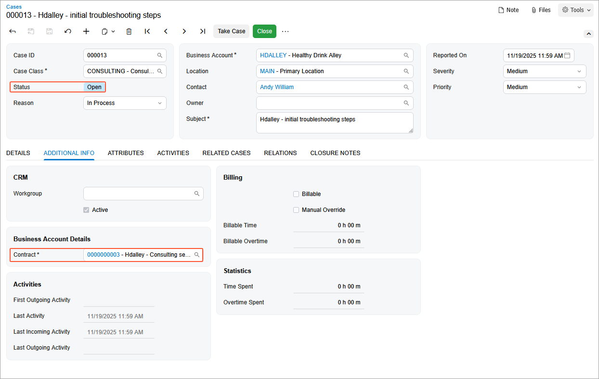
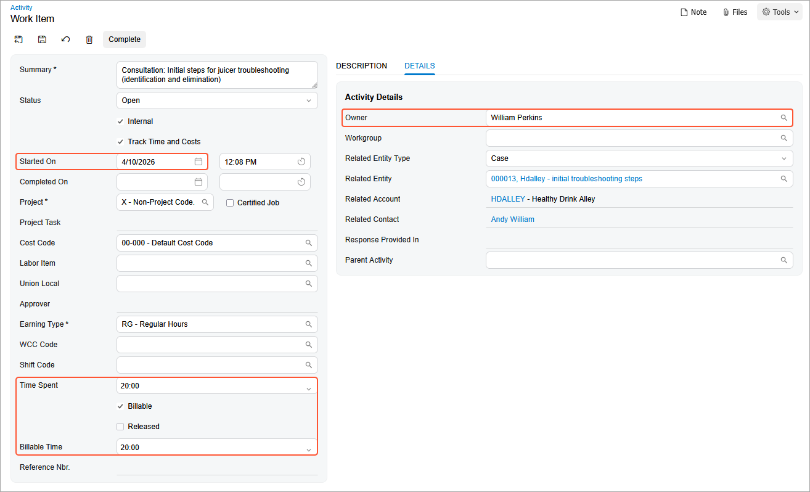
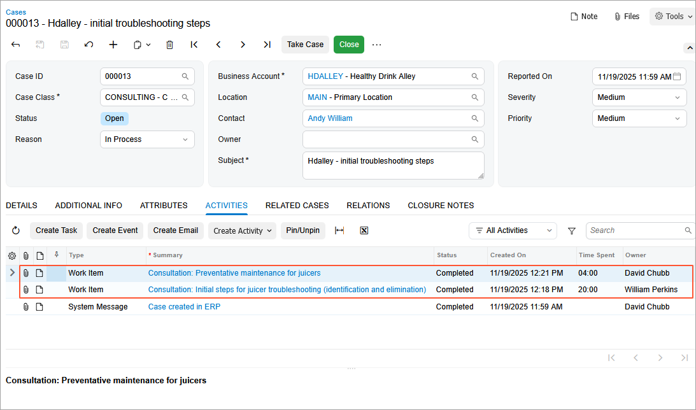
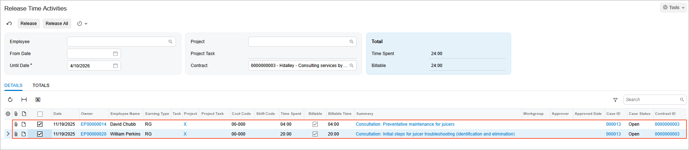

# Contract Usage: To Create Employee Activity Usage \(Consulting Contract\) {#_a863f04f-14f7-447c-9cc8-8043561dfa43 .task}

In this activity, you will learn how to create contract usage by employee activities \(cases\), and then you will create and release a case.

**Attention:** This activity is based on the *U100* dataset. If you are using another dataset or if any system settings have been changed in *U100*, these changes can affect the workflow of the activity and the results of the processing. To avoid issues, restore the *U100* dataset to its initial state.

## Story { .section}

Suppose that after purchasing the juicers, the Healthy Drink Alley customer needs a consulting contract to teach employees about the proper use of juicers and related equipment. This service is provided by the SweetLife Fruits &amp; Jams company's consultants of different qualifications: senior consultants, whose services cost $120 per hour, and consultants, whose services cost $100 per hour.

According to the terms of the contract, on *4/10/2026* the customer obtains consulting in the amount of 20 hours from the senior consultant William Perkins, and in the amount of 4 hours from the consultant David Chubb in the total amount of $2,800. The billing of the contract will be performed on demand and on per-activity basis.

Acting as a sales manager, you have created an empty contract whose terms determine prices depending on the skills and position of the consulting specialist, who can be a regular specialist or a senior consultant. You will create contract usage to reflect rendering services in the system.

## Process Overview { .section}

In this activity, on the [Cases](CR_30_60_00.md) \(CR306000\) form, you will create a case and then on the [Activity](CR_30_60_10.md) \(CR306010\) form, you will create case activities of employees with different qualifications. On the [Activity](CR_30_60_10.md) form, you will release activities simultaneously creating contract usage you will bill later.

## Configuration Overview { .section}

In the *U100* dataset, the following tasks have been performed to support this activity:

-   On the [Enable/Disable Features](CS_10_00_00.md) \(CS100000\) form, the *Contract Management* feature has been enabled.
-   On the [Customers](AR_30_30_00.md) \(AR303000\) form, the *HDALLEY \(Healthy Drink Alley\)* customer has been created.

## System Preparation { .section}

To prepare to perform the instructions of this activity, do the following:

1.  As a prerequisite to this activity, complete [Contract Setup and Activation: To Create and Activate an Empty Consulting Contract Draft](config_Contract_Management_Implem_Activity_To_Configure_Empty_Contract_Draft_Consulting_Contract.md) activity to create and activate the empty contract you will use to create employee activities usage.
2.  To prepare to perform the instructions of this activity, launch the Acumatica ERP website with the *U100* dataset preloaded, and sign in as the sales manager David Chubb using the *chubb* username and the *123* password.
3.  In the info area, in the upper-right corner of the top pane of the Acumatica ERP screen, make sure that the business date in your system is set to *4/10/2026*. For simplicity, in this activity, you will create and process all documents in the system on this business date.

## Step 1: Creating a Case {#section_j4k_gyr_js .section}

To create the case for the consulting contract, do the following:

1.  On the [Cases](CR_30_60_00.md) \(CR306000\) form, add new record.
2.  In the Summary area, specify the following settings:
    -   **Case Class**: *CONSULTING*
    -   **Business Account**: *HDALLEY*
    -   **Subject**: `Hdalley - initial troubleshooting steps`
3.  On the form toolbar, click **Open**.
4.  In the **Open** dialog box, make sure *In Process* is selected in the **Reason** box, and click **OK**. Notice that the system has assigned the *Open* status to the case.
5.  On the **Additional Info** tab, make sure that the contract with description *Hdalley - Consulting services by employee rates* is selected in the **Contract** box. The system selects the contract automatically because it is the only contract associated with the selected customer.

    

## Step 2: Creating Employee Case Activities {#section_d3l_lyr_js .section}

In Acumatica ERP, *time activities* are activities for which employees report the time that they have spent on them. You use case activities, which are billable time activities of employees, to create contract usage.

To create billable time activities for the case you created, do the following:

1.  While you are still viewing the case you have created on the [Cases](CR_30_60_00.md) \(CR306000\) form, go to the **Activities** tab.
2.  On the table toolbar, click **Create Activity** &gt; **Create Work Item**.
3.  On the [Activity](CR_30_60_10.md) \(CR306010\) form, which opens, specify the following settings:
    -   **Summary**: `Consultation: Initial steps for juicer troubleshooting (identification and elimination)`
    -   **Start Date**: *4/10/2026*
    -   **Project**: *X - Non-Project Code*
    -   **Time Spent**: *20:00*
    -   **Billable Time**: *20:00*
4.  In the **Owner** box of the **Details** tab, specify *William Perkins*.

    

5.  On the form toolbar, click **Save** and then click **Complete** to complete the activity.

    The system closes the window with the form and returns you to the [Cases](CR_30_60_00.md) form.

6.  On the table toolbar of the **Activities** tab, click **Create Activity** &gt; **Create Work Item**.
7.  On the [Activity](CR_30_60_10.md) form, which opens, specify the following settings:
    -   **Summary**: `Consultation: Preventative maintenance for juicers`
    -   **Start Date**: *4/10/2026*
    -   **Project**: *X - Non-Project Code*
    -   **Time Spent**: *04:00*
    -   **Billable Time**: *04:00*
8.  In the **Owner** box of the **Details** tab, specify *David Chubb*.
9.  On the form toolbar, click **Save** and then click **Complete** to complete the activity. The system closes the window with the form and returns you to the [Cases](CR_30_60_00.md) form.

    Notice that both activities are listed on the **Activities** tab.

    

## Step 3: Releasing Case Activities {#section_ns5_dzr_js .section}

To release the case activities for a future billing, do the following:

1.  Open the [Release Time Activities](EP_50_70_20.md) \(EP507020\) form.
2.  In the Summary area, in the **Contract** box, select the contract with description *Hdalley - Consulting services by employee rates*. The list now shows activities for only this contract. Select the check boxes for both case activities in the table as shown in the following screenshot.

    

3.  On the form toolbar, click **Release**.

    The released activities created usages for the consulting contract. If you bill the contract, the resulting invoice will contain information about each of the activities.

## Step 4: Viewing Contract Usage Details {#section_ets_fzr_js .section}

To view the generated contract usages, do the following:

1.  On the [Contract Usage](CT_30_30_00.md) \(CT303000\) form, in the **Contract ID** box, select the contract with description *Hdalley - Consulting services by employee rates*.
2.  On the **Unbilled** tab, review the details about both of the released activities. This tab displays information about both accumulated unbilled usages for the selected contract.

You have created employee activities usage for the consulting contract and now you can proceed to billing the contract by per-activity basic.

**Parent topic:**[Tracking Contract Usage](../UserGuide/Contracts_Contract_Usage_Mapref.md)

