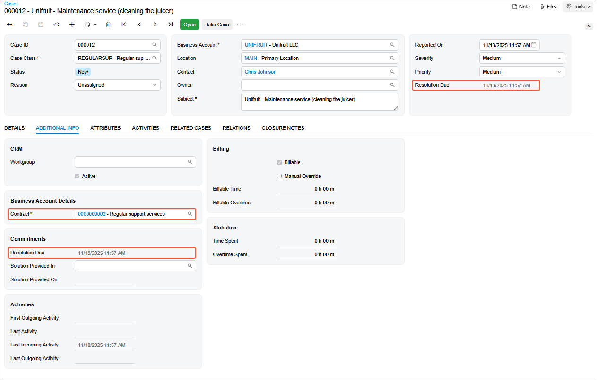

# Contract Usage: To Create Case Usage \(Support Contract\) {#_f2beca0b-a900-4b25-8be4-57a1737b3453 .task}

In this activity, you will learn how to create case usage for a support contract.

**Attention:** This activity is based on the *U100* dataset. If you are using another dataset or if any system settings have been changed in *U100*, these changes can affect the workflow of the activity and the results of the processing. To avoid issues, restore the *U100* dataset to its initial state.

## Story { .section}

Suppose that the SweetLife Fruits &amp; Jams company, in addition to deploying juicers, also specializes in providing maintenance. The Unifruit LLC customer previously purchased juicers and now needs to enter into a maintenance support contract. On *3/8/2026*, the support contract was signed by both parties.

According to the terms of the contract, it has the *Expiring* type, and the contract span is three months. On *3/10/2026*, the service under the contract was provided by one regular specialist for four hours for a total sum of $480. This service was reflected in the system in a separate case.

The service of maintenance specialists costs $120 per hour, and the price is not dependent on the skills and position of the employee. The billing of the contract will be performed monthly and on a per-case basis.

Now you have an empty support contract in the system. Acting as a sales manager, you will create case usage for the support contract.

## Process Overview { .section}

On the [Cases](CR_30_60_00.md) \(CR306000\) form, you will create, resolve, and release a case to reflect the rendering service in the system. Then on the [Contract Usage](CT_30_30_00.md) \(CT303000\) form, you will review the contract usage to make sure the usage of contract has been created in the system.

## Configuration Overview { .section}

In the *U100* dataset, the following tasks have been performed to support this activity:

-   On the [Enable/Disable Features](CS_10_00_00.md) \(CS100000\) form, the *Contract Management* feature has been enabled.
-   On the [Customers](AR_30_30_00.md) \(AR303000\) form, the *UNIFRUIT \(Unifruit LLC\)* customer has been created.

## System Preparation { .section}

To prepare to perform the instructions of this activity, do the following:

1.  As a prerequisite to this activity, complete the [Contract Setup and Activation: To Create and Activate an Empty Support Contract Draft](config_Contract_Management_Implem_Activity_To_Configure_Empty_Contract_Draft_Support_Contract.md) activity to create an empty contract draft and activate it. You will use this contract during the creation of the case.
2.  Launch the Acumatica ERP website with the *U100* dataset preloaded, and sign in as the sales manager David Chubb by using the *chubb* username and the *123* password.
3.  In the info area, in the upper-right corner of the top pane of the Acumatica ERP screen, make sure that the business date in your system is set to *3/10/2026*.

## Step 1: Entering a Case {#section_rvl_whz_js .section}

To enter a support case, proceed as follows:

1.  On the [Cases](CR_30_60_00.md) \(CR306000\) form, add a new record.
2.  In the Summary area, specify the following settings:
    -   **Case Class**: *REGULARSUP*

        When you selected the *REGULARSUP* case class, default values of the class were filled in for the case.

    -   **Business Account**: *UNIFRUIT*
    -   **Contact**: *Chris Johnson*
    -   **Subject**: `Unifruit - Maintenance service (cleaning the juicer)`
3.  On the **Details** tab, in the text area, type the following description of the request or issue that pertained to the case:

    `The customer wants the company to clean, wash, and sterilize the juicer.`

4.  On the **Additional Info** tab, in the **Contract** box, make sure that the contract with description *Unifruit - Regular support services* has been specified \(see the screenshot below\).
5.  On the form toolbar, click **Save**.

    When you save the case, the system fills in the read-only **Resolution Due** box in the Summary area. This box is also shown on the **Additional Info** tab, as you can see in the screenshot. The inserted time is based on the settings of the *REGULARSUP* case class, which indicate that cases with medium severity should be resolved within eight hours after the case was initially saved.

    

6.  On the form toolbar, click **Open** to open the case.
7.  In the **Open** dialog box, leave *In Process* in the **Reason** box, and click **OK**. Now the case has the *Open* status.

## Step 2: Resolving and Releasing the Case {#section_rfr_xhz_js .section}

While remaining on the [Cases](CR_30_60_00.md) \(CR306000\) form viewing the case you have created, do the following to resolve the case:

1.  On the **Additional Info** tab, select the **Manual Override** check box, and in the **Billable Time** box, type `4h 00m`, which is the number of hours it has taken the specialist to resolve the case.
2.  On the form toolbar, click **Close** to mark the case as resolved \(because only resolved and closed cases can be released for billing\).
3.  In the **Close** dialog box, leave *Resolved* in the **Reason** box, and click **OK**. Notice that the case now has the *Closed* status.

    As a result, the case becomes resolved, and most of the boxes on the form become unavailable for editing.

4.  On the form toolbar, click **Release** to release the case.

    The status of the case has changed to *Released*. The released case creates contract usage of the contract, so if you bill the contract now, the resulting invoice will contain information about the case.

## Step 3: Reviewing the Contract Usage {#section_sdx_zhz_js .section}

Before billing the contract, you may want to review the contract usage so that you know what exactly will be included in the invoice. For these purposes, on the [Contract Usage](CT_30_30_00.md) \(CT303000\) form, do the following:

1.  In the Summary area, select the contract with description *Unifruit - Regular support services* in the **Contract ID** box.
2.  On the **Unbilled** tab, view the record that represents the case you have just released.

    On this tab, the system shows information about unbilled usage for the selected contract. You can edit the records in the table; also, you can add or delete records to adjust the total amount of unbilled contract usage.

You have created, resolved, and released the case to create the contract usage in the system for the support contract. Now you can proceed to billing the contract by case usage.

**Parent topic:**[Tracking Contract Usage](../UserGuide/Contracts_Contract_Usage_Mapref.md)

