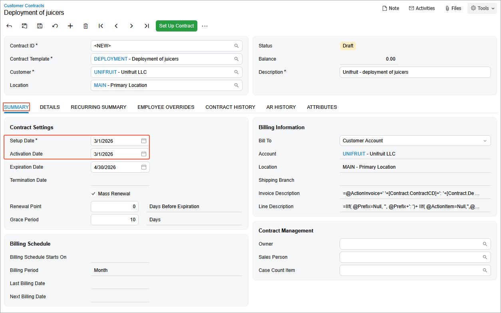
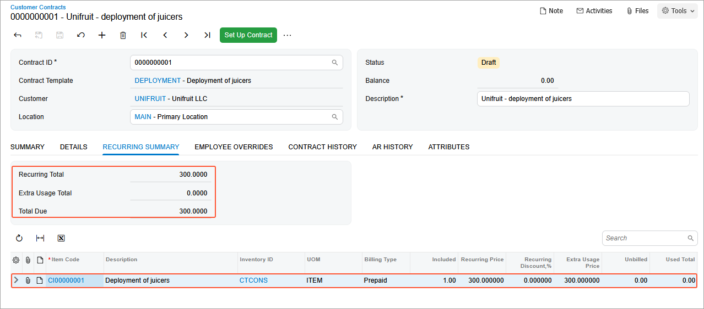

# Contract Configuration: To Create a Regular Contract Draft {#_51a1c73e-7a18-456d-8e27-4b7d35a3b599 .task}

In this activity, you will learn how to create a draft of a regular contract.

**Attention:** This activity is based on the *U100* dataset. If you are using another dataset or if any system settings have been changed in *U100*, these changes can affect the workflow of the activity and the results of the processing. To avoid issues, restore the *U100* dataset to its initial state.

## Story { .section}

Suppose that the SweetLife Fruits &amp; Jams company supplies its customers with a piece of equipment for juice production and provides deployment, maintenance, and consulting services. On *3/1/2026*, the Unifruit LLC customer asks the company to deploy juicers in a newly opened restaurant.

Because the contract agreement is standard, a fixed-price contract draft for deployment will be created based on the data included in the template. A regular fixed-price contract for deployment includes such terms as a two-month contract span, the activation date as the starting point of the billing schedule, a monthly billing period, the ability to renew the contract, a 10-day grace period, and the *CI00000001 \(Deployment of juicers\)* contract item. In a fixed-price contract, payment amounts are constant and do not change depending on the costs incurred by SweetLife during the fulfillment of the contract.

Acting as a sales manager, you need to create a fixed-price contract draft for the particular customer based on the contract template that you have created.

## Configuration Overview { .section}

In the *U100* dataset, the following tasks have been performed to support this activity:

-   On the [Enable/Disable Features](CS_10_00_00.md) \(CS100000\) form, the *Contract Management* feature has been enabled.
-   On the [Customers](AR_30_30_00.md) \(AR303000\) form, the *UNIFRUIT \(Unifruit LLC\)* customer has been created.
-   On the [Segmented Keys](CS_20_20_00.md) \(CS202000\) form, auto-numbering for the *CONTRACT* segmented key has been enabled.

## Process Overview { .section}

In this activity, on the [Customer Contracts](CT_30_10_00.md) \(CT301000\) form, you will create a new contract draft. The contract draft will be based on the contract template that you have created in the [Contract Template Creation: To Create a Regular Contract Template](config_Contract_Management_Implem_Activity_To_Configure_Contract_Template.md) activity.

## System Preparation { .section}

To prepare to perform the instructions of this activity, do the following:

1.  As a prerequisite to this activity, complete [Contract Template Creation: To Create a Regular Contract Template](config_Contract_Management_Implem_Activity_To_Configure_Contract_Template.md) to create the contract template you will use to create the contract draft for a regular service contract.
2.  Launch the Acumatica ERP website with the *U100* dataset preloaded, and sign in as the sales manager David Chubb by using the *chubb* username and the *123* password.
3.  In the info area, in the upper-right corner of the top pane of the Acumatica ERP screen, make sure that the business date in your system is set to *3/1/2026*. For simplicity, in this activity, you will create and process all documents in the system on this business date.

## Step: Creating a Contract Draft {#section_pxm_cqp_dtb .section}

To create a contract draft, do the following:

1.  On the [Customer Contracts](CT_30_10_00.md) \(CT301000\) form, add a new record.
2.  In the **Contract Template** box of the Summary area, select *DEPLOYMENT* to base the new contract on this template. The system automatically fills in settings—such as the contract item, the expiration date, and the billing policy—with the default values copied from the selected template.

    **Tip:** Because you have selected the **Enable Template Item Override** check box for the contract template on the [Contract Templates](CT_20_20_00.md) \(CT202000\) form, on the **Details** tab, you can modify the contract items included in the contract, change the quantity and description of any contract item, add new contract items, and remove contract items from the list. Also, you can enter new prices for non-stock items that have the pricing policy set to *Enter Manually* on the **Price Options** tab of the [Contract Items](CT_20_10_00.md) \(CT201000\) form.

3.  In the **Customer** box, select *UNIFRUIT*. The contract will be billed to this customer account because the **Bill To** box on the **Summary** tab of the form contains the *Customer Account* option.
4.  In the **Description** box, type `Unifruit - deployment of juicers`.
5.  In the **Contract Settings** section of the **Summary** tab, specify the following settings \(see the screenshot below\):

    -   **Setup Date**: *3/1/2026*
    -   **Activation Date**: *3/1/2026*

        You can change these dates when you click the **Set Up Contract** or **Activate Contract** commands on the More menu \(under **Processing**\). The **Setup Date** and **Activation Date** boxes become read-only after the respective command has been performed.

    

6.  On the **Details** tab, make sure that only the line with the *CI00000001 \(Deployment of juicers\)* contract item has been added.
7.  On the form toolbar, click **Save**.

    **Tip:** Because you have enabled auto-numbering for the *CONTRACT* segmented key, on which contract identifiers are based, the system will assign the contract identifier automatically when the contract is saved. \(If auto-numbering had been disabled, in the **Contract ID** box, you would specify the ID of the contract manually; otherwise, the system would issue an error when you save the contract draft.\)

8.  On the **Recurring Summary** tab, view the details of all recurring items associated with the contract, as shown in the following screenshot.

    

You have created the contract with the *Draft* status. Now you can proceed to signing and activating it.

**Parent topic:**[Configuring Contracts](../UserGuide/Contracts_Configuring_Contracts_Mapref.md)

