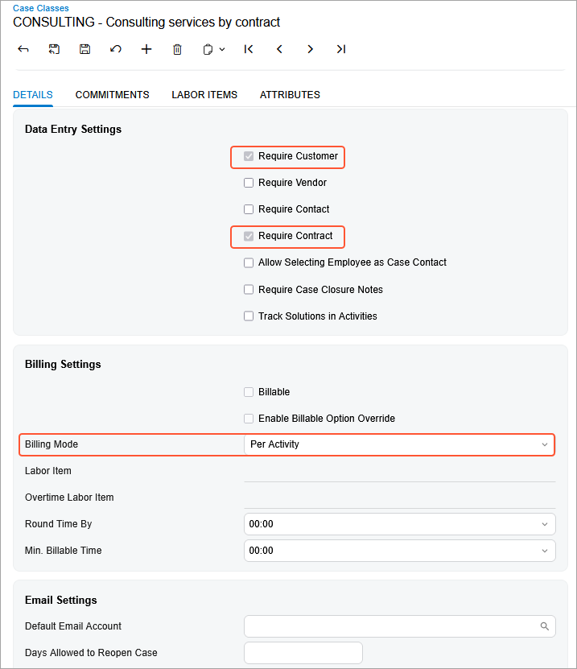

# Contract Configuration: To Create Entities for a Consulting Contract {#_cfbf697d-128c-4d7f-959e-4d6d8f04bd83 .task}

In this activity, you will learn how to create labor items and a case class for an empty contract template that will be used for a consulting contract.

**Attention:** This activity is based on the *U100* dataset. If you are using another dataset or if any system settings have been changed in *U100*, these changes can affect the workflow of the activity and the results of the processing. To avoid issues, restore the *U100* dataset to its initial state.

## Story { .section}

Suppose that after purchasing the juicers, the Healthy Drink Alley customer needs a consulting contract to teach employees about the proper use of juicers and related equipment. This service is provided by the SweetLife Fruits &amp; Jams company's consultants of different qualifications: senior consultants, whose services cost $120 per hour, and other regular consultants, whose services cost $100 per hour.

According to the terms of the contract, in April 2026, the customer obtains 20 hours of consulting from the senior consultant William Perkins, and 4 hours from the consultant David Chubb for the total amount of $2,800. The billing of the contract will be performed on demand and on a per-activity basis.

Acting as a sales manager, you will create a contract for which prices depend on the skills and position of the consulting specialist, who can be a regular or a senior consultant.

## Process Overview { .section}

In this activity on the [Non-Stock Items](IN_20_20_00.md) \(IN202000\) form, you will create labor items with employee rates for a regular and a senior consultants, and then on the [Case Classes](CR_20_60_00.md) \(CR206000\) form, you will create a case class.

## Configuration Overview { .section}

In the *U100* dataset, the following tasks have been performed to support this activity:

-   On the [Enable/Disable Features](CS_10_00_00.md) \(CS100000\) form, the *Contract Management* feature has been enabled.
-   On the [Customers](AR_30_30_00.md) \(AR303000\) form, the *HDALLEY \(Healthy Drink Alley\)* customer has been created.
-   On the [Chart of Accounts](GL_20_25_00.md) \(GL202500\) form, the *79000* \(*Contract Expenses*\) expense account and the *40300* \(*Sales - Consulting Services*\) sales accounts have been created.

## System Preparation { .section}

To prepare to perform the instructions of this activity, launch the Acumatica ERP website with the *U100* dataset preloaded, and sign in as the sales manager David Chubb using the *chubb* username and the *123* password.

## Step 1: Creating Labor Items with Employee Rates {#section_s5h_22c_jt .section}

On the [Non-Stock Items](IN_20_20_00.md) \(IN202000\) form, perform the following instructions:

1.  To create a non-stock item for the consulting services that are performed by a regular specialist, do the following:
    1.  Add a new record.
    2.  Specify the following settings in the Summary area:
        -   **Inventory ID**: `CTCONSREG`
        -   **Description**: `Consulting services by regular consultant`
    3.  On the **General** tab, specify the following settings:
        -   **Type**: *Labor*
        -   **Posting Class**: *NONSTOCK*
        -   **Tax Category**: *EXEMPT*
        -   **Require Receipt**: Cleared
        -   **Require Shipment**: Cleared
        -   **Base Unit**: *HOUR*
        -   **Sales Unit**: *HOUR*
        -   **Purchase Unit**: *HOUR*
    4.  On the **Price/Cost** tab, specify `100` in the **Default Price** box.
    5.  On the **GL Accounts** tab, specify the following settings:
        -   **Expense Account**: *79000* \(*Contract Expenses*\)

            This account accumulates the expenses that company spends to provide contract preparation.

        -   **Sales Account**: *40300* \(*Sales - Consulting Services*\)

            This account accumulates the revenue earned when employees provide consulting services.

    6.  On the form toolbar, click **Save** to save the non-stock item.
2.  To create a non-stock item for the consulting services that are performed by a senior consultant, do the following:
    1.  Add a new record.
    2.  Specify the following settings in the Summary area:
        -   **Inventory ID**: `CTCONSSEN`
        -   **Description**: `Consulting services by senior consultant`
    3.  On the **General** tab, specify the following settings:
        -   **Type**: *Labor*
        -   **Posting Class**: *NONSTOCK*
        -   **Tax Category**: *EXEMPT*
        -   **Require Receipt**: Cleared
        -   **Require Shipment**: Cleared
        -   **Base Unit**: *HOUR*
        -   **Sales Unit**: *HOUR*
        -   **Purchase Unit**: *HOUR*
    4.  On the **Price/Cost** tab, specify `120` in the **Default Price** box.
    5.  On the **GL Accounts** tab, specify the following settings:
        -   **Expense Account**: *79000* \(*Contract Expenses*\)
        -   **Sales Account**: *40300* \(*Sales - Consulting Services*\)
    6.  On the form toolbar, click **Save** to save the non-stock item.

## Step 2: Creating a Case Class of Per Activity Billing Mode {#section_rg1_yfc_jt .section}

To create a case class for consulting services, do the following:

1.  On the [Case Classes](CR_20_60_00.md) \(CR206000\) form, add a new record.
2.  In the Summary area, specify `CONSULTING` in the **Case Class ID** box and `Consulting services by contract` in the **Description** box.
3.  On the **Details** tab, specify the following settings \(see the screenshot below\):

    -   **Require Customer**: Selected
    -   **Require Contract**: Selected
    -   **Billing Mode**: *Per Activity*

        The *Per Activity* billing mode indicates that the cases of the class will be billed on a per-activity basis. For example, you can use this option for large cases that cannot be closed by the end of the billing period so that you can bill activities associated with an ongoing case. For each activity associated with a case of the class, you can specify whether it is billable or not.

    

4.  Click **Save** to save the created case class.

In this activity you have created the labor items and the case class with per-activity billing settings. These entities you will use later to create an empty contract template for the consulting contract.

**Parent topic:**[Configuring Contracts](../UserGuide/Contracts_Configuring_Contracts_Mapref.md)

