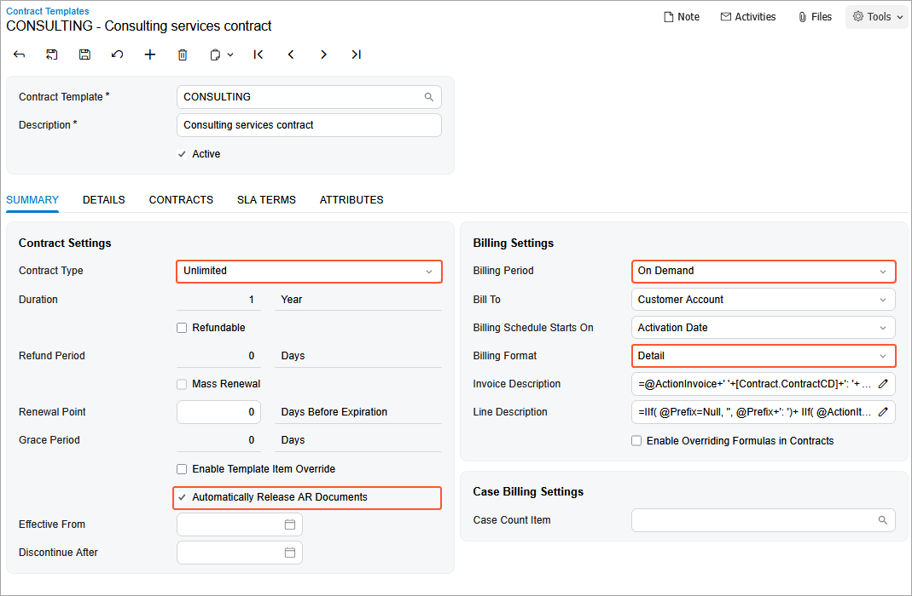

# Contract Template Creation: To Create an Empty Consulting Contract Template {#_19b3a1b9-6fcb-4358-8686-55b90bf14dc0 .task}

In this activity, you will learn how to create an empty contract template of the *Unlimited* type for a consulting contract.

This contract and the template it is based on will be empty, containing no contract items, although other settings are specified for them.

**Attention:** This activity is based on the *U100* dataset. If you are using another dataset or if any system settings have been changed in *U100*, these changes can affect the workflow of the activity and the results of the processing. To avoid issues, restore the *U100* dataset to its initial state.

## Story { .section}

Suppose that after purchasing the juicers, the Healthy Drink Alley customer needs a consulting contract to teach employees about the proper use of juicers and related equipment. This service is provided by the SweetLife Fruits &amp; Jams company's consultants of different qualifications: senior consultants, whose services cost $120 per hour, and regular consultants, whose services cost $100 per hour.

According to the terms of the contract, in April 2026, the customer obtains consulting in the amount of 20 hours from the senior consultant William Perkins, and in the amount of 4 hours from the consultant David Chubb for a total amount of $2,800. The billing of the contract will be performed on demand and on a per-activity basis.

Acting as a sales manager, you will create an empty contract template.

## Process Overview { .section}

In this activity on the [Contract Templates](CT_20_20_00.md) \(CT202000\) form, you will create the empty contract template with employee rates that depend on their qualifications.

## Configuration Overview { .section}

In the *U100* dataset, the following tasks have been performed to support this activity:

-   On the [Enable/Disable Features](CS_10_00_00.md) \(CS100000\) form, the *Contract Management* feature has been enabled.
-   On the [Customers](AR_30_30_00.md) \(AR303000\) form, the *HDALLEY \(Healthy Drink Alley\)* customer has been created.

## System Preparation { .section}

To prepare to perform the instructions of this activity, do the following:

1.  As a prerequisite to this activity, complete the [Contract Configuration: To Create Entities for a Consulting Contract](config_Contract_Management_Implem_Activity_To_Create_Contract_Items_for_Consulting_template_Empty.md) to create labor items and a case class you will use during the creation on the empty contract.
2.  To prepare to perform the instructions of this activity, launch the Acumatica ERP website with the *U100* dataset preloaded, and sign in as the sales manager David Chubb using the *chubb* username and the *123* password.

## Step: Creating an Empty Contract Template {#section_r3k_rgh_2tb .section}

To create an empty contract template, do the following:

1.  On the [Contract Templates](CT_20_20_00.md) \(CT202000\) form, add a new record.
2.  In the **Contract Template** box of the Summary area, type `CONSULTING`.
3.  In the **Description** box, type `Consulting services contract`.
4.  In the **Contract Settings** section of the **Summary** tab, do the following:
    1.  In the **Contract Type** box, select *Unlimited*.

        Contracts of this type have no expiration date. If you want to discontinue the providing of services under the terms of an unlimited contract, you must terminate the contract.

    2.  Select the **Automatically Release AR Documents** check box so that the invoices and credit memos are automatically released when the contract is billed.
5.  In the **Billing Settings** section of the **Summary** tab, do the following:

    1.  In the **Billing Period** box, select *On Demand*, which indicates that no billing is scheduled for the contracts based on this template, and you will be able to run contract billing any time you need to bill the customer for the services you have provided. This option cannot be used with any contract item that includes a recurring item unless the recurring item is associated with a deposit item or has a default quantity of zero.
    2.  In the **Billing Format** box, select *Detail*. Each occurrence of contract usage \(that is, each employee activity\) will be shown as a separate line in the invoices generated when you bill the contract. You can change the billing format for this template at any time, and this change will affect the format of the invoices generated afterward for any existing contracts based on the template. You can see the settings of the template in the following screenshot.
    

6.  In the Summary area, make sure the **Active** check box is selected so that contracts can be created based on the template.
7.  On the form toolbar, click **Save**.

You have created the empty contract template with billing on demand and on per-activity base for consulting contracts and now you can proceed to a contract preparation.

**Parent topic:**[Creating Contract Templates](../UserGuide/Contracts_Configuring_Contract_Templates_Mapref.md)

