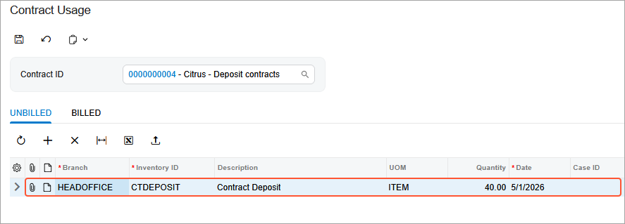

# Contract Usage: To Create Usage \(Deposit Contract\) {#_e4a19aed-9d15-4b11-9686-8035ff94276a .task}

In the following implementation activity, you will learn how to manually create contract usage for a deposit contract.

**Attention:** This activity is based on the *U100* dataset. If you are using another dataset or if any system settings have been changed in *U100*, these changes can affect the workflow of the activity and the results of the processing. To avoid issues, restore the *U100* dataset to its initial state.

## Story { .section}

Suppose that the Citrus Store customer wants to purchase a fixed number of support hours in advance, for which the SweetLife Fruits &amp; Jams company offers a discount. According to the terms of the deposit contract, the customer pays a deposit in advance for work that will be performed later, and the total price of the provided service will be deducted from the deposit in parts upon the completion of each service.

According to the terms of the contract, SweetLife will receive an advance payment from the Citrus Store in the amount of $5,000. In May 2026, SweetLife's employees will provide consulting services for a total of 50 support hours at a discounted price of $100 per hour. All support hours beyond the included hours will be billed at a higher price of $120 per hour.

Acting as a sales manager, you will manually create contract usage in the amount of 40 hours for a deposit contract.

## Configuration Overview { .section}

In the *U100* dataset, the following tasks have been performed to support this activity:

-   On the [Enable/Disable Features](CS_10_00_00.md) \(CS100000\) form, the *Contract Management* feature has been enabled.
-   On the [Customers](AR_30_30_00.md) \(AR303000\) form, the *CITRUS \(Citrus Store\)* customer has been created.

## Process Overview { .section}

On the [Cases](CR_30_60_00.md) \(CR306000\) form, you will create contract usage manually to reflect the rendering service in the system for a deposit contract.

## System Preparation { .section}

To prepare to perform the instructions of this activity, do the following:

1.  As a prerequisite to this activity, complete the [Contract Setup and Activation: To Create and Activate a Deposit Contract](config_Contract_Management_Implem_Activity_To_Configure_Deposit_Contract_Draft.md) to create and activate the deposit contract you will use during the creation of contract usage.
2.  To prepare to perform the instructions of this activity, launch the Acumatica ERP website with the *U100* dataset preloaded, and sign in as the sales manager David Chubb using the *chubb* username and the *123* password.
3.  In the info area, in the upper-right corner of the top pane of the Acumatica ERP screen, make sure that the business date in your system is set to *5/1/2026*.

## Step: Manual Creating of a Contract Usage {#section_zjh_vvg_2tb .section}

To manually add contract usage in the system for the deposit contract, do the following:

1.  Open the [Contract Usage](CT_30_30_00.md) \(CT303000\) form.
2.  In the **Contract ID** box, select the contract with description *Citrus - Deposit contracts*.
3.  On the **Unbilled** tab, add a row to the table, and enter the following settings in the added row \(as shown in the following screenshot\):

    -   **Branch**: *HEADOFFICE*
    -   **Inventory ID**: *CTDEPOSIT*
    -   **Quantity**: `40`
    -   **Date**: *5/1/2026*
    

4.  Click **Save** on the form toolbar.

You have created the contract usage manually for the deposit contract. Now you can proceed to the billing of the contract.

**Parent topic:**[Tracking Contract Usage](../UserGuide/Contracts_Contract_Usage_Mapref.md)

