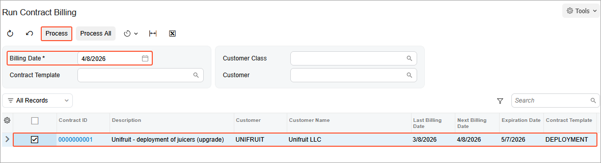
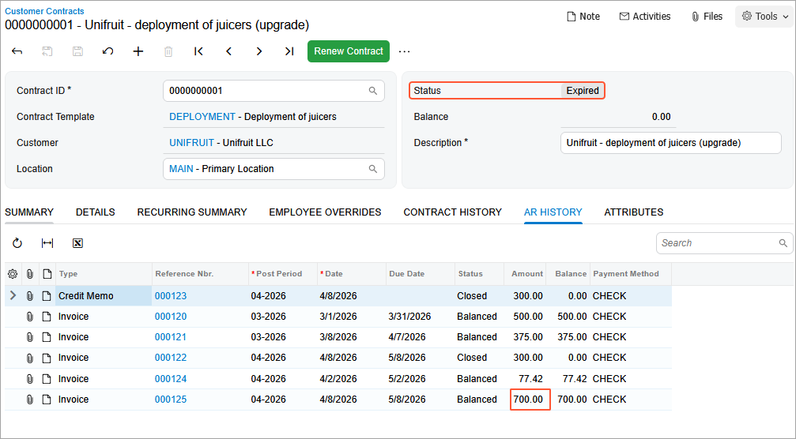
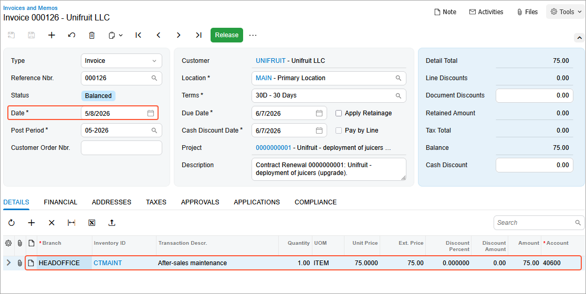

# Contract Management: To Renew a Contract {#_63d68d3a-0131-4e4c-b647-db20e4ec63e2 .task}

In this activity, you will learn how to renew a contract of the *Renewable* type.

**Attention:** This activity is based on the *U100* dataset. If you are using another dataset or if any system settings have been changed in *U100*, these changes can affect the workflow of the activity and the results of the processing. To avoid issues, restore the *U100* dataset to its initial state.

## Story { .section}

Suppose that the SweetLife Fruits &amp; Jams company supplies its Unifruit LLC customer with juicers and provides deployment, maintenance support, and consulting services. The contract span of the regular contract is two months, and the starting date of the contract is *3/1/2026*. Before signing the contract during contract negotiations, the customer asked to add to the contract the capability to renew the contract under the same terms and to specify *5/8/2026* as the contract renewal date.

According to the terms of the contract, when contract renewal occurs, the customer will be billed a fixed amount of $75, which is calculated from the amount of the deployment fee \($500 \* 15% = $75\). On *4/2/2026*, the contract was upgraded, so the recurring fee for consulting services increased from $300 to $700.

Acting as an accountant, you will first bill the contract for the consulting services until the contract obtains an *Expired* status.

Then acting as a sales manager, you will renew the contract.

## Configuration Overview { .section}

In the *U100* dataset, the following tasks have been performed to support this activity:

-   On the [Enable/Disable Features](CS_10_00_00.md) \(CS100000\) form, the *Contract Management* feature has been enabled.
-   On the [Accounts Receivable Preferences](AR_10_10_00.md) \(AR101000\) form, on the **General** tab \(**Data Entry Settings** section\), the **Hold Documents on Entry** check box has been cleared.
-   On the [Customers](AR_30_30_00.md) \(AR303000\) form, the *UNIFRUIT \(Unifruit LLC\)* customer has been created.

## Process Overview { .section}

In this activity, on the [Run Contract Billing](CT_50_10_00.md) \(CT501000\) and [Customer Contracts](CT_30_10_00.md) \(CT301000\) form, you will first bill the deployment contract until it obtains the *Expired* status, and then you will renew the contract.

Then you will review the generated invoice by using the [Invoices and Memos](AR_30_10_00.md) \(AR301000\) form.

## System Preparation { .section}

To prepare to perform the instructions of this activity, do the following:

1.  As a prerequisite to this activity, make sure that the contract has been upgraded, as described in the [Contract Management: To Upgrade a Contract](config_Contract_Management_Implem_Activity_To_Upgrade_Contract.md) activity.
2.  Launch the Acumatica ERP website with the *U100* dataset preloaded, and sign in as the accountant Anna Johnson by using the *johnson* username and the *123* password.
3.  In the info area, in the upper-right corner of the top pane of the Acumatica ERP screen, make sure that the business date in your system is set to *4/8/2026*. For simplicity, in this activity, you will create and process all documents in the system on this business date.

## Step 1: Billing the Contracts {#section_ngl_qhz_js .section}

On the [Run Contract Billing](CT_50_10_00.md) \(CT501000\) mass-processing form, you can bill multiple contracts at the same time \(or just one contract\).

To bill the contract by using a mass-processing form, do the following:

1.  Open the [Run Contract Billing](CT_50_10_00.md) \(CT501000\) form.
2.  In the **Billing Date** box, select *4/8/2026*.

    The system displays a list of contracts whose next billing date is earlier than the billing date or the same as it.

3.  In the table, select the unlabeled check box for the *0000000001 \(Unifruit - deployment of juicers \(upgrade\)\)* contract, as shown in the following screenshot.

    

4.  On the form toolbar, click **Process**.
5.  In the **Processing** dialog box, which opens, review the results of the processing and click **Close** to close the dialog box.
6.  On the [Customer Contracts](CT_30_10_00.md) \(CT301000\) form, open the *0000000001 \(Unifruit - deployment of juicers \(upgrade\)\)* contract. Notice the next billing date \(*5/7/2026*\) in the **Next Billing Date** box on the **Summary** tab.
7.  In the info area, in the upper-right corner of the top pane of the Acumatica ERP screen, select the business date 5/7/2026.
8.  On the form toolbar, click **Run Contract Billing**.
9.  Notice that the contract now has the *Expired* status, and no invoice has been issued because *5/7/2026* is the final billing date of the contract. According to the terms of the modified contract, on the *4/8/2026*, it was billed for consulting services in the amount of $700 \($300 + $400\) after the contract upgrade.

    

You have billed the regular contract twice, and now it has the *Expired* status. Now you can proceed with renewing the contract to a new period.

## Step 2: Renewing the Contract {#section_frs_h4p_dtb .section}

To renew the contract of the *Renewable* type with an *Expired* status, do the following:

1.  Sign in to the system as a sales manager by using the *chubb* username and the *123* password.
2.  In the info area, in the upper-right corner of the top pane of the Acumatica ERP screen, make sure that the business date in your system is set to *5/8/2026*.
3.  On the [Customer Contracts](CT_30_10_00.md) \(CT301000\) form, in the **Contract ID** box, select *0000000001 \(Unifruit - deployment of juicers \(upgrade\)\)*.
4.  On the form toolbar, click **Renew Contract**.
5.  In the **Renewal Date** box of the **Renew Contract** dialog box, which opens, leave *5/8/2026*, and then click **OK**.

    After the operation has completed, the system sets the expiration date of the contract to *7/7/2026* because on the [Contract Templates](CT_20_20_00.md) \(CT202000\) form, you specified the duration of the deployment contract to be two months. Also, the contract's status changes to *Active*, and the renewal fee of $75 is billed.

6.  On the **AR History** tab of the form, click the **Reference Nbr.** link in the last row to review the last generated invoice in the amount of $75 on the [Invoices and Memos](AR_30_10_00.md) \(AR301000\) form.

    In the invoice, the *CTMAINT* non-stock item is listed on the **Details** tab, because this non-stock item has been specified as a renewal item on the **Price Options** tab of the [Contract Items](CT_20_10_00.md) \(CT201000\) form \(**Setup and Renewal** section\). The unit price for the *CI00000001 \(Deployment of juicers\)* contract item is calculated as 15% of the setup item price \($500 \* 0.15 = $75\). The invoice date \(*5/8/2026*\) matches the date of the contract renewal.

    

You have renewed the contract. Now you can proceed with terminating it.

**Parent topic:**[Managing Contracts](../UserGuide/Contracts_Managing_Contracts_Mapref.md)

