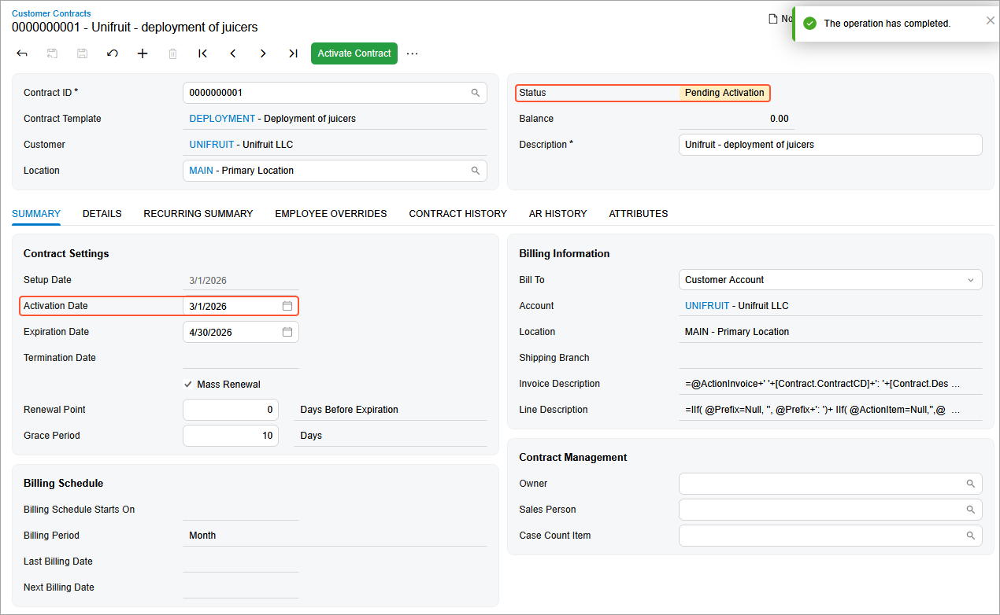
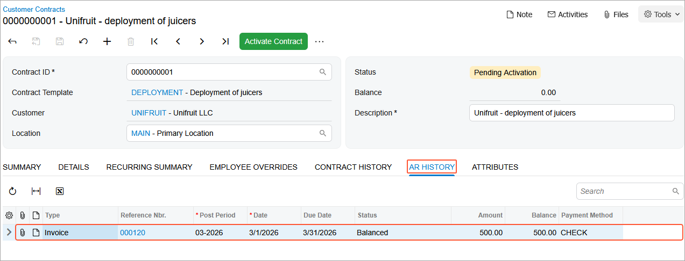
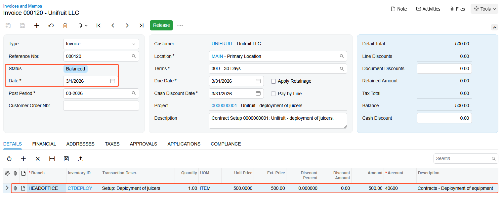
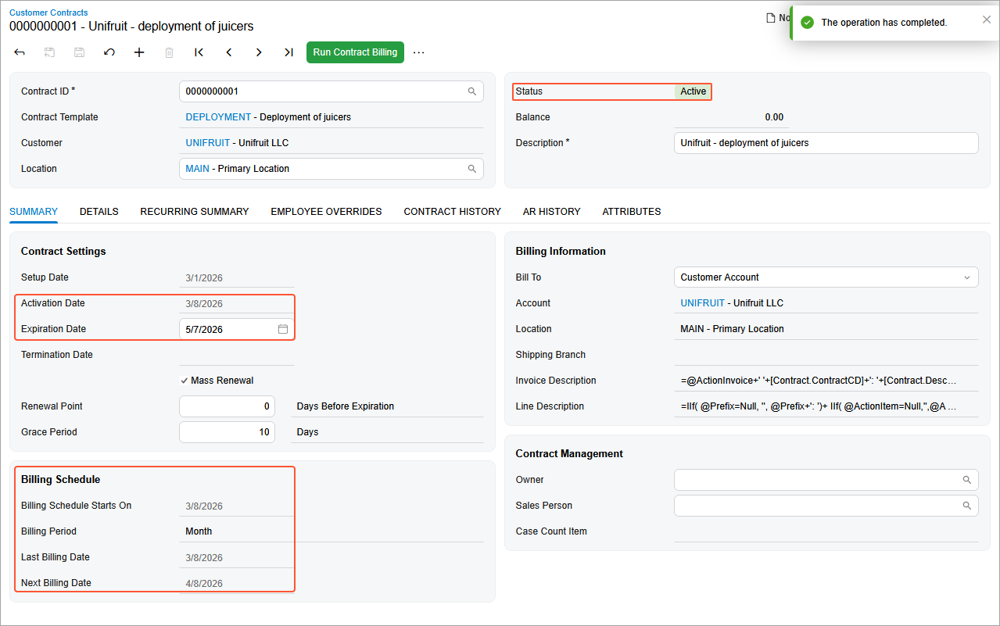
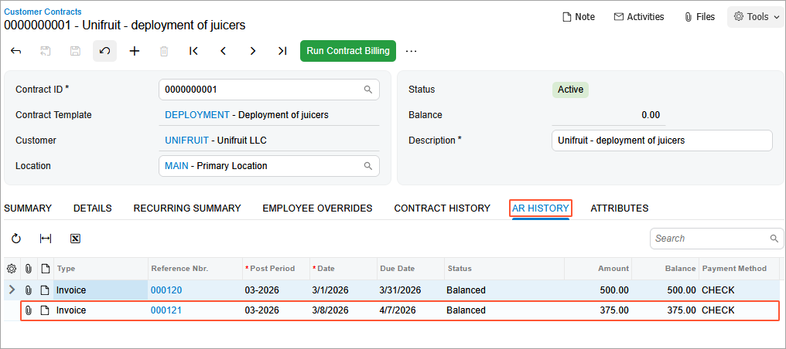
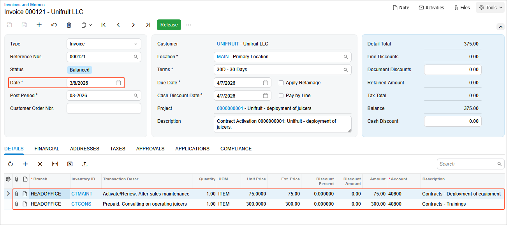

# Contract Setup and Activation: To Set Up and Activate a Regular Contract {#_96198cf0-d3cf-4a15-9ee7-a4e45c9ea6be .task}

In this activity, you will learn how to set up and activate a contract.

**Attention:** This activity is based on the *U100* dataset. If you are using another dataset or if any system settings have been changed in *U100*, these changes can affect the workflow of the activity and the results of the processing. To avoid issues, restore the *U100* dataset to its initial state.

## Story { .section}

Suppose that the SweetLife Fruits &amp; Jams company supplies its customer, Unifruit LLC, with equipment for juice production and provides deployment services for the purchased equipment. A typical deployment fixed-price contract includes the deployment of equipment, a maintenance support service, and consulting. In a fixed-price contract, payment amounts are constant and do not change depending on the costs incurred by the SweetLife Fruits &amp; Jams company during the fulfillment of the contract.

The setup date of the contract is *3/1/2026*, and the activation date of the contract is *3/8/2026* because the SweetLife Fruits &amp; Jams company will provide the services starting on this date. The contract should span two months, with the possibility of renewal.

According to the terms of the contract, the customer will be billed in the amount of $500 for the juicer deployment service and the initial actions when contract setup takes place. In addition, the customer will be billed a fixed amount of $75, which is 15% of the deployment fee for a juicer maintenance at the moment of contract activation or on contract renewal. The customer will also be billed monthly in the amount of $300 at the beginning of each scheduled billing period for the consulting service that is to be provided during the duration of the contract.

Acting as a sales manager, you need to set up and activate the contract. Also, you need to review the activation and setup invoices, which indicate the successful activation of the contract.

## Configuration Overview { .section}

In the *U100* dataset, the following tasks have been performed to support this activity:

-   On the [Enable/Disable Features](CS_10_00_00.md) \(CS100000\) form, the *Contract Management* feature has been enabled.
-   On the [Accounts Receivable Preferences](AR_10_10_00.md) \(AR101000\) form on the **General** tab \(**Data Entry Settings** section\), the **Hold Documents on Entry** check box has been cleared.
-   On the [Customers](AR_30_30_00.md) \(AR303000\) form, the *UNIFRUIT \(Unifruit LLC\)* customer has been created.

## Process Overview { .section}

In this activity, on the [Customer Contracts](CT_30_10_00.md) \(CT301000\) form, you will set up the contract. Then on the [Invoices and Memos](AR_30_10_00.md) \(AR301000\) form, you will review the setup invoice. You will then activate the contract and review the activation invoice by using these forms.

## System Preparation { .section}

To prepare to perform the instructions of this activity, do the following:

1.  As a prerequisite to this activity, in [Contract Configuration: To Create a Regular Contract Draft](config_Contract_Management_Implem_Activity_To_Create_Contract_Draft.md) activity, the *0000000001 \(Unifruit - deployment of juicers\)* contract has been created and now it has the *Draft* status.
2.  Launch the Acumatica ERP website with the *U100* dataset preloaded, and sign in as the sales manager David Chubb by using the *chubb* username and the *123* password.
3.  In the info area, in the upper-right corner of the top pane of the Acumatica ERP screen, make sure that the business date in your system is set to *3/1/2026*. For simplicity, in this activity, you will create and process all documents in the system on this business date.

## Step 1: Setting Up the Contract {#section_urj_bgz_js .section}

On the [Customer Contracts](CT_30_10_00.md) \(CT301000\) form, proceed as follows:

1.  In the **Contract ID** box, select *0000000001 \(Unifruit - deployment of juicers\)*.
2.  On the form toolbar, click **Set Up Contract**.

    The **Set Up Contract** dialog box opens.

3.  In the **Setup Date** box, make sure that *3/1/2026* is specified, and then click **OK**.

    Notice the following changes on the form:

    -   The contract has the *Pending Activation* status.
    -   On the **Summary** tab, the setup date is unavailable for editing.
    

## Step 2: Reviewing the Setup Invoice {#section_e22_trf_ft .section}

To review the setup invoice, do the following:

1.  While you are still viewing the contract on the [Customer Contracts](CT_30_10_00.md) \(CT301000\) form, review the **AR History** tab \(shown in the following screenshot\). Notice that it now shows the details of the invoice that the system has issued for the deployment services provided on contract setup.

    

    Because you have cleared the **Hold Documents on Entry** check box on the [Accounts Receivable Preferences](AR_10_10_00.md) \(AR101000\) form, the status of the generated invoice depends on whether the **Automatically Release AR Documents** check box is selected for the contract template on the [Contract Templates](CT_20_20_00.md) \(CT202000\) form. For the *DEPLOYMENT* contract template, this check box is cleared, so the generated invoice has the *Balanced* status.

2.  Click the link in the **Reference Nbr.** column to open the setup invoice on the [Invoices and Memos](AR_30_10_00.md) \(AR301000\) form. Review the invoice.

    

    The invoice includes only one line, whose settings have been copied from the *CTDEPLOY* non-stock item.

    The invoice date, which is displayed in the **Date** box of the Summary area, matches the setup date of the related contract, whose identifier and description are displayed in the **Project/Contract** box.

## Step 3: Activating the Contract {#section_xmq_2gz_js .section}

On the [Customer Contracts](CT_30_10_00.md) \(CT301000\) form, again open the contract that you have created and set up, and proceed as follows:

1.  On the form toolbar, click **Activate Contract**.
2.  In the **Activation Date** box of the **Activate Contract** dialog box, which opens, specify *3/8/2026*, and then click **OK**. Notice the following changes on the form \(see below\):

    -   The contract has the *Active* status.
    -   The activation date is unavailable for editing.
    -   The **Expiration Date** is set to *5/7/2026*, and the **Billing Schedule** section has been populated with the appropriate details.
    

## Step 4: Reviewing the Activation Invoice {#section_llt_5rf_ft .section}

To review the activation invoice, do the following:

1.  While you are still viewing the contract on the [Customer Contracts](CT_30_10_00.md) \(CT301000\) form, on the **AR History** tab, review the list of the invoices that have been issued for the customer contract \(see the following screenshot\).

    

2.  Click the **Reference Nbr.** link in the second row to open the invoice for review on the [Invoices and Memos](AR_30_10_00.md) \(AR301000\) form \(shown in the screenshot below\), and make sure of the following:

    -   The invoice date, which is displayed in the **Date** box, matches the activation date of the related contract \(*3/8/2026*\).
    -   The invoice amount is $375. Notice that the invoice also includes the **Activate/Renew** fee, which is generated on contract activation.

        The **Activate/Renew** fee is set for the *CTMAINT* non-stock item in the **Renewal Price** box of the [Contract Items](CT_20_10_00.md) \(CT201000\) form \(**Price Options** tab\), and calculated as 15% of the setup item price \($500 \* 0.15 = $75\).

    -   The activation invoice includes two lines:
        -   The line with the *CTMAINT* item, which represents the activation/renewal item in the amount of the activation/renewal price \($75\)
        -   The line with the *CTCONS* item, which represents a recurring item, the amount of recurring fees for consulting \($300\)
    

You have set up and activated the contract with the *Draft* status and now the contract has an *Active* status. Now you can proceed with billing the contract.

**Parent topic:**[Setting Up and Activating Contracts](../UserGuide/Contracts_Setting_Up_Contracts_Mapref.md)

