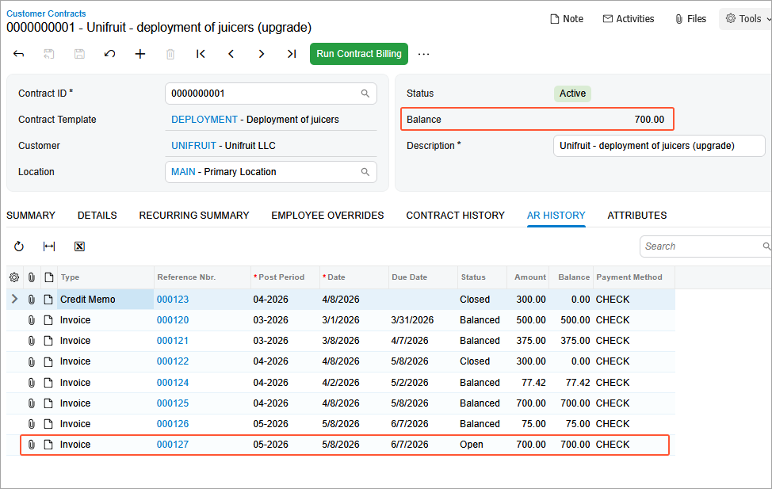
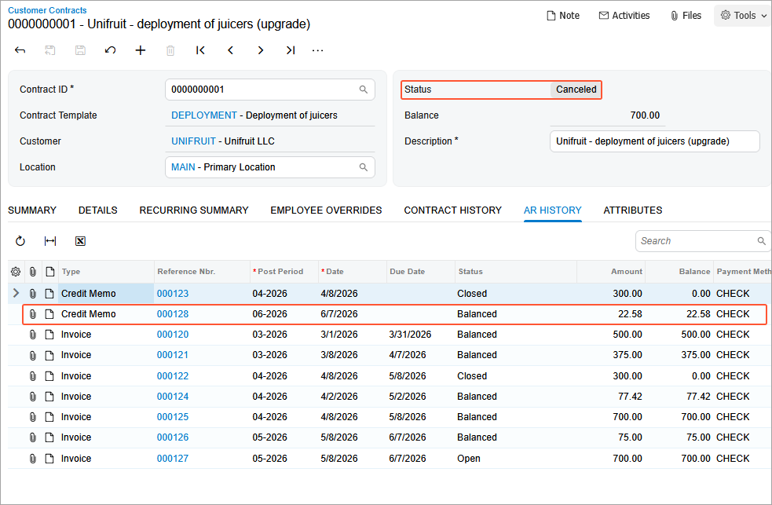
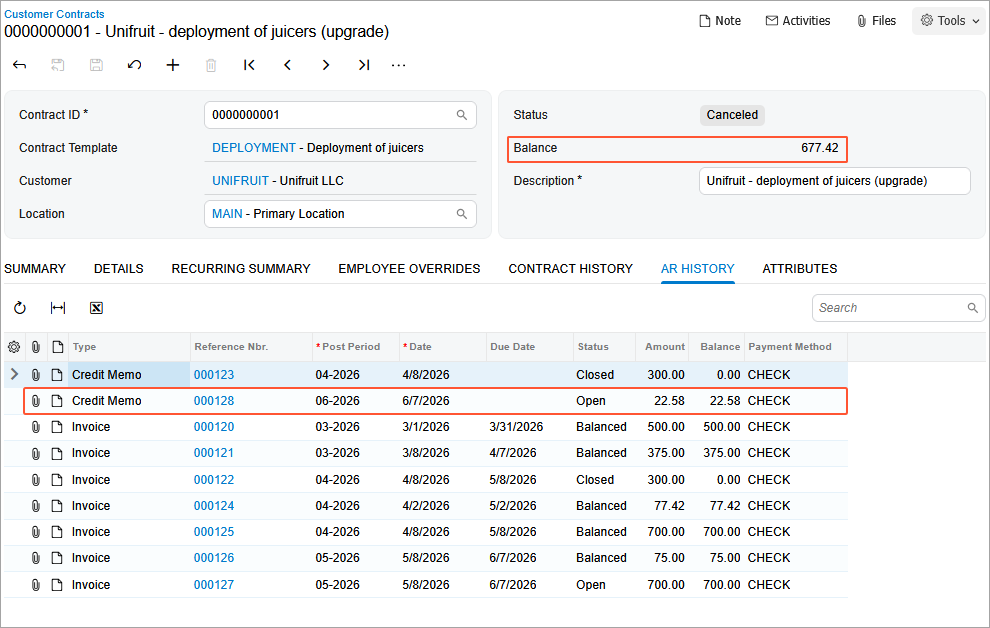

# Contract Management: To Terminate a Contract {#_0b41990c-9204-4471-9f32-00895b29a479 .task}

In this activity, you will learn how to terminate a contract.

**Attention:** This activity is based on the *U100* dataset. If you are using another dataset or if any system settings have been changed in *U100*, these changes can affect the workflow of the activity and the results of the processing. To avoid issues, restore the *U100* dataset to its initial state.

## Story { .section}

Suppose that the SweetLife Fruits &amp; Jams company supplies its Unifruit LLC customer with juicers and provides deployment services for the purchased equipment. A typical regular deployment contract includes deployment, maintenance support, and consulting services. The start date of the contract is *3/1/2026*. The contract should span two months, with the possibility of renewal.

According to the terms of the contract, the customer will be billed once in the amount of $500 for the juicer deployment service and initial actions when contract setup takes place. Also, the customer will be billed a fixed amount of $75, which is 15% of the deployment fee for juicer maintenance at the moment of contract activation or on contract renewal. In addition, the customer will be billed monthly for $700 at the beginning of each scheduled billing period for the consulting service that is to be provided during the duration of the contract.

The parties have started to perform the contract in March 2026, and on *5/7/2026*, SweetLife Fruits &amp; Jams has completed the billing of the contract, causing the contract to be assigned the *Expired* status. Because at the moment of concluding of the contract, the parties determined that they would renew the contract, it was renewed on *5/8/2026* on the same terms.

However, on *6/2/2026*, Unifruit urgently informed SweetLife that the service under the contract is no longer required and asked to terminate the contract as of *6/7/2026*.

SweetLife and Unifruit agreed to terminate the contract starting on this date.

Acting as an accountant, you will first bill the renewed contract by the schedule for the consulting service rendered before termination of the contract.

Then acting as a sales manager, you will terminate the contract since *6/7/2026*.

## Configuration Overview { .section}

In the *U100* dataset, the following tasks have been performed to support this activity:

-   On the [Enable/Disable Features](CS_10_00_00.md) \(CS100000\) form, the *Contract Management* feature has been enabled.
-   On the [Accounts Receivable Preferences](AR_10_10_00.md) \(AR101000\) form, on the **General** tab \(**Data Entry Settings** section\), the **Hold Documents on Entry** check box has been cleared.
-   On the [Customers](AR_30_30_00.md) \(AR303000\) form, the *UNIFRUIT \(Unifruit LLC\)* customer has been created.

## Process Overview { .section}

In this activity, on the [Customer Contracts](CT_30_10_00.md) \(CT301000\) form, you will first bill the deployment contract to provide consulting services until the termination date of the contract. Then on the [Invoices and Memos](AR_30_10_00.md) \(AR301000\) form, you will release the invoice issued for the services provided.

On the [Customer Contracts](CT_30_10_00.md) form, you will terminate the contract, and on the [Invoices and Memos](AR_30_10_00.md) form, you will review the credit memo the system has issued after termination of the contract.

## System Preparation { .section}

To prepare to perform the instructions of this activity, do the following:

1.  As a prerequisite to this activity, make sure that the contract has been renewed, as described in [Contract Management: To Renew a Contract](config_Contract_Management_Implem_Activity_To_Renew_Contract.md) activity.
2.  Launch the Acumatica ERP website with the *U100* dataset preloaded, and sign in as the accountant Anna Johnson by using the *johnson* username and the *123* password.
3.  In the info area, in the upper-right corner of the top pane of the Acumatica ERP screen, make sure that the business date in your system is set to *5/8/2026*.

## Step 1: Billing the Contract {#section_ngl_qhz_js .section}

To bill the contract, do the following:

1.  On the [Customer Contracts](CT_30_10_00.md) \(CT301000\) form, open the *0000000001 \(Unifruit - deployment of juicers \(upgrade\)\)* contract. Notice the next billing date \(*5/8/2026*\) in the **Next Billing Date** box on the **Summary** tab.
2.  On the form toolbar, click **Run Contract Billing** to perform billing for consulting services. Notice the next billing date \(*6/8/2026*\) on the **Summary** tab.

Now you can proceed with the releasing the invoice.

## Step 2: Releasing the Invoice {#section_hlp_33z_js .section}

Do the following to release the invoice that has been generated during billing by schedule for the consulting services:

1.  While you are still viewing the contract on the [Customer Contracts](CT_30_10_00.md) \(CT301000\) form, on the **AR History** tab, click the **Reference Nbr.** link to open the invoice that you have created in Step 1. Notice that the invoice has the *Balanced* status.
2.  On the form toolbar of the [Invoices and Memos](AR_30_10_00.md) \(AR301000\) form, click **Release**. The system generates and releases a batch in the general ledger. You can see the batch on the **Financial** tab \(**Link to GL** section\) of the [Invoices and Memos](AR_30_10_00.md) form.
3.  On the [Customer Contracts](CT_30_10_00.md) \(CT301000\) form, open the *0000000001 \(Unifruit - deployment of juicers \(upgrade\)\)* contract. Press F5 to refresh the form.

    On the **AR History** tab, notice that the invoice now has the *Open* status. Review the contract balance \($700\), which is calculated as the sum of the balances of open invoices associated with the contract.

    

You have released the invoice that the system has generated after billing. Now you can proceed with the termination of the contract.

## Step 3: Terminating the Contract {#section_ymz_kfz_js .section}

To terminate the contract, do the following:

1.  Sign in to the system as a sales manager by using the *chubb* username and the *123* password.
2.  In the info area, in the upper-right corner of the top pane of the Acumatica ERP screen, make sure that the business date in your system is set to *6/7/2026*.
3.  On the [Customer Contracts](CT_30_10_00.md) \(CT301000\) form, open the *0000000001 \(Unifruit - deployment of juicers \(upgrade\)\)* contract.
4.  On the More menu \(under **Processing**\), click **Terminate Contract**. In the **Terminate Contract** dialog box, which opens, leave *6/7/2026* in the **Termination Date** box, and then click **OK**.

    When the termination operation completes successfully, the status of the contract is *Canceled*.

    Notice that the balance of the contract is $700. At the moment of contract termination, if the contract has any unbilled usage or prepaid refundable items, the system generates an invoice or a credit memo, respectively. In our example, for the *0000000001 \(Unifruit - deployment of juicers\)* contract, the system has generated a credit memo in the amount of $22.58, which you can see on the **AR History** tab.

    

## Step 4: Releasing of the Credit Memo { .section}

To release the credit memo, do the following:

1.  Sign in to the system as an accountant by using the *johnson* username and the *123* password.
2.  In the info area, in the upper-right corner of the top pane of the Acumatica ERP screen, make sure that the business date in your system is set to *6/7/2026*.
3.  On the [Customer Contracts](CT_30_10_00.md) \(CT301000\) form, open the *0000000001 \(Unifruit - deployment of juicers \(upgrade\)\)* contract.
4.  In the table on the **AR History** tab, click the reference number of the last credit memo with the **Balanced** status in the amount of $22.58 to open the credit memo for releasing it. The credit memo opens on the [Invoices and Memos](AR_30_10_00.md) \(AR301000\) form.
5.  On the form toolbar, click **Release**. The system generates and releases a batch in the general ledger. You can see the batch on the **Financial** tab \(**Link to GL** section\) of the [Invoices and Memos](AR_30_10_00.md) form.
6.  On the [Customer Contracts](CT_30_10_00.md) \(CT301000\) form, open the *0000000001 \(Unifruit - deployment of juicers\)\)* contract. Press F5 to refresh the form.

    Notice that on the **AR History** tab, the credit memo now has the *Open* status. Review the contract balance \($677.42\), which is the sum of the services rendered to the customer until the moment of the contract termination.

    

You have terminated the contract.

**Parent topic:**[Managing Contracts](../UserGuide/Contracts_Managing_Contracts_Mapref.md)

