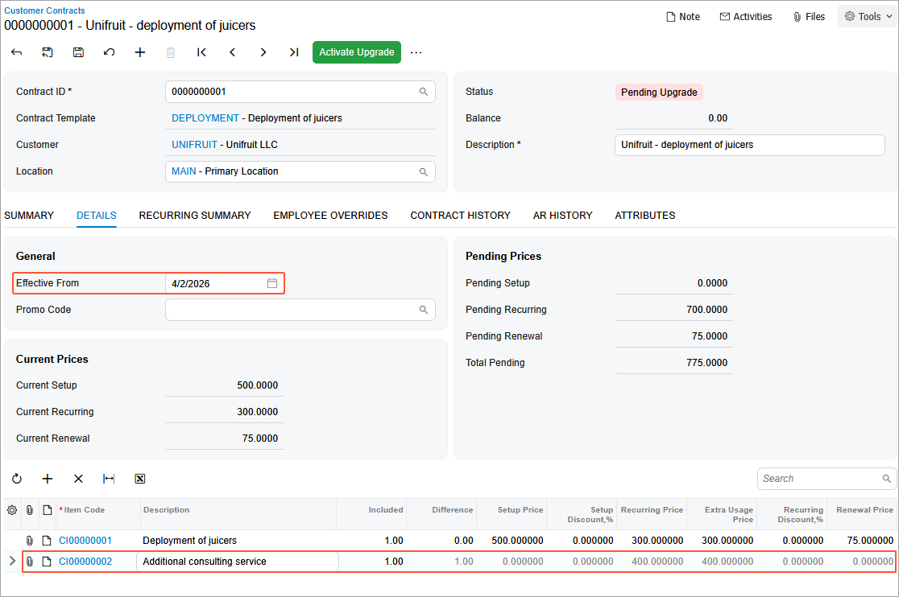
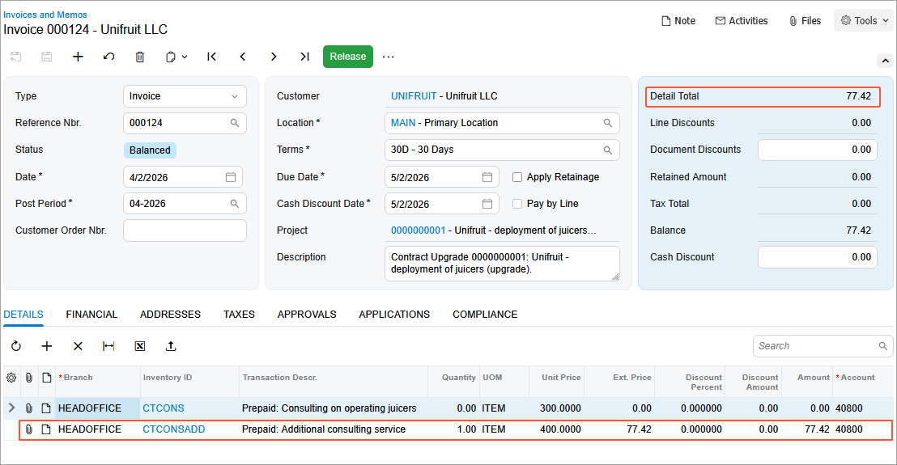

# Contract Management: To Upgrade a Contract {#_2c076112-ab88-42f8-83fd-e7c1da9ab498 .task}

In this activity, you will learn how to modify terms of the contract and activate the contract upgrade.

**Attention:** This activity is based on the *U100* dataset. If you are using another dataset or if any system settings have been changed in *U100*, these changes can affect the workflow of the activity and the results of the processing. To avoid issues, restore the *U100* dataset to its initial state.

## Story { .section}

Suppose that on *3/1/2026*, the Unifruit LLC customer asks the SweetLife Fruits &amp; Jams company to deploy juicers in the newly opened restaurant. SweetLife supplies Unifruit with equipment for a juice production and provides deployment, maintenance support service, and consulting. A regular deployment contract includes such terms as a two–month contract span, the activation date as the starting point of the billing schedule, a monthly billing period, a recurring billing amount of $300, the ability to be renewed, a 10-day grace period, and the *CI00000001 \(Deployment of juicers\)* contract item.

In the end of March 2026, during the fulfillment of the contract, Unifruit asked SweetLife to change the terms of the contract, add an additional consulting service to the contract, and define *4/2/2026* as the date when the additional consulting service begins.

According to the upgraded terms of the contract, when the contract is upgraded, the customer will obtain a supplementary consulting service in addition to the service, which the parties stipulated in the primary terms of the contract. According to the terms of the modified contract, it will be billed for consulting services in the amount of $700 \($300 + $400\) after the contract upgrade.

Acting as a sales manager, first you will create a new non-stock item and a contract item for the additional consulting service to define new terms of the contract. Then you will activate the contract upgrade.

## Configuration Overview { .section}

In the *U100* dataset, the following tasks have been performed to support this activity:

-   On the [Enable/Disable Features](CS_10_00_00.md) \(CS100000\) form, the *Contract Management* feature has been enabled.
-   On the [Accounts Receivable Preferences](AR_10_10_00.md) \(AR101000\) form on the **General** tab \(**Data Entry Settings** section\), the **Hold Documents on Entry** check box has been cleared.
-   On the [Customers](AR_30_30_00.md) \(AR303000\) form, the *UNIFRUIT \(Unifruit LLC\)* customer has been created.
-   On the [Chart of Accounts](GL_20_25_00.md) \(GL202500\) form, the *79000* expense account \(*Contract Expenses*\) and the *40800* \(*Contracts - Trainings*\) sales account have been created.

## Process Overview { .section}

In this activity, on the [Non-Stock Items](IN_20_20_00.md) \(IN202000\) form, you will create a new non-stock item and specify recurring settings for it. On the [Stock Items](IN_20_25_00.md) \(IN202500\) form, you will then create a contract item for an additional consulting service. On the [Customer Contracts](CT_30_10_00.md) \(CT301000\) form, you will modify the contract and activate the contract upgrade.

## System Preparation { .section}

To prepare to perform the instructions of this activity, do the following:

1.  As a prerequisite to this activity, the contract has been billed once and invoice have been released, as described in the [Contract Billing: To Bill a Regular Contract on a Schedule](config_Contract_Management_Implem_Activity_To_Bill_Contract_by_Schedule.md) activity, then the billing action was canceled as described in the [Contract Management: To Cancel the Last Action](config_Contract_Management_Implem_Activity_To_Cancel_Last_Action.md) activity.
2.  Launch the Acumatica ERP website with the *U100* dataset preloaded, and sign in as the sales manager David Chubb by using the *chubb* username and the *123* password.
3.  In the info area, in the upper-right corner of the top pane of the Acumatica ERP screen, make sure that the business date in your system is set to *4/2/2026*. For simplicity, in this activity, you will create and process all documents in the system on this business date.

## Step 1: Creating a Non-Stock Item {#section_eg5_vnz_jt .section}

To create the non-stock item for the additional consulting service, proceed as follows:

1.  On the [Non-Stock Items](IN_20_20_00.md) \(IN202000\) form, add a new record.
2.  Specify the following settings in the Summary area:
    -   **Inventory ID**: `CTCONSADD`
    -   **Description**: `Additional consulting service`
3.  On the **General** tab, specify the following settings:
    -   **Type**: *Non-Stock Item*
    -   **Posting Class**: *NONSTOCK*
    -   **Tax Category**: *EXEMPT*
    -   **Require Receipt**: Cleared
    -   **Require Shipment**: Cleared
    -   **Base Unit**: *ITEM*
    -   **Purchase Unit**: *ITEM*
    -   **Base Unit**: *ITEM*
4.  On the **Price/Cost** tab, specify `400` in the **Default Price** box.
5.  On the **GL Accounts** tab, specify the following settings:
    -   **Expense Account**: *79000* \(*Contract Expenses*\)
    -   **Sales Account**: *40800* \(*Contracts - Trainings*\)
6.  On the form toolbar, click **Save** to save the non-stock item.

## Step 2: Creating a Contract Item {#section_kyx_1lq_ls .section}

Now you will create a contract item for an additional contract service. You will then include this contract item in the existing deployment contract to modify it. To create a new contract item, do the following:

1.  On the [Contract Items](CT_20_10_00.md) \(CT201000\) form, add a new record.
2.  In the **Description** box of the Summary area, type `Additional consulting service`.
3.  On the **Price Options** tab, specify the following settings:
    -   **Maximum Allowed Quantity**: `1`
    -   **Minimum Allowed Quantity**: `1`
    -   **Default Quantity**: `1`
4.  In the **Recurring Billing** section of the tab, specify the following settings:
    -   **Billing Type**: *Prepaid*
    -   **Recurring Item**:*CTCONSADD*
    -   **Recurring Pricing**: *Use Item Price*
5.  On the form toolbar, click **Save**.

## Step 3: Modifying the Contract Terms {#section_oyq_glq_ls .section}

To modify terms of the deployment contract for the Unifruit LLC customer, proceed as follows:

1.  On the [Customer Contracts](CT_30_10_00.md) \(CT301000\) form, open the *0000000001 \(Unifruit - Deployment of juicers\)* contract.
2.  On the More menu \(under **Processing**\), click **Upgrade Contract**. The status of the contract changes to *Pending Upgrade*. With this status, you can now modify the list of items included in the contract.
3.  On the **Details** tab, add a new row to the table, and in the **Item Code** column, select *CI00000002 \(Additional consulting service\)*.
4.  In the **Effective From** box, specify *4/2/2026*. This is the date when your company is going to start providing the additional services \(see the following screenshot\).

    

5.  Click **Save** on the form toolbar.

Now you can activate the contract upgrade.

**Attention:** Whether you are upgrading a contract, the process is performed in two stages: preparation and activation. During the preparation stage, while you are modifying the terms of the contract, the contract can be billed and services can be provided in accordance with the initial settings of the contract. The system starts using the settings you specify only after the contract upgrade has been activated.

## Step 4: Activating the Contract Upgrade {#section_kjv_zrq_ls .section}

On the [Customer Contracts](CT_30_10_00.md) \(CT301000\) form, open the *0000000001 \(Unifruit - Deployment of juicers\)* contract, and do the following:

1.  In the **Description** box of the Summary area, type `Unifruit - deployment of juicers (upgrade)`.
2.  On the form toolbar, click **Activate Upgrade**.
3.  In the **Activation Date** box of the **Activate Contract** dialog box, which opens, leave *4/2/2026*, and then click **OK**. The contract is assigned the *Active* status.

    Starting on the upgrade activation date, the new terms will be used for contract billing.

4.  On the **AR History** tab, click the **Reference Nbr.** link of the invoice in the last row in the table. The system opens the [Invoices and Memos](AR_30_10_00.md) \(AR301000\) form with the invoice that was generated when the contract upgrade was activated.

    The details of this invoice \(see below\) include a newly added service in the amount of $400. In the Summary area of the invoice, review the value in the **Detail Total** box, which is $77.42 because the company has rendered an additional service to the Unifruit LLC customer from *4/2/2026* through *4/8/2026* after activation of the upgrade.

    

Starting on the next billing date \(*4/8/2026*\), recurring invoices will be issued according to the contract billing schedule for upgraded services in the amount of $700 \($300 + $400\).

You have modified the contract terms and activated the contract upgrade. Now you can proceed with billing the contract on new terms, renewing, or terminating it.

**Parent topic:**[Managing Contracts](../UserGuide/Contracts_Managing_Contracts_Mapref.md)

