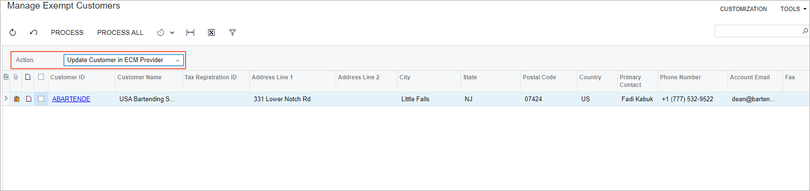

# Exception Certificate Management: General Information {#_14dd4f03-53cd-431e-9c7b-06e5dbc018d3 .concept}

In Acumatica ERP, you can configure tax-exemption functionality through Avalara integration. This gives you the ability to request the tax exemption certificates from eligible customers and keep the certificates updated. As a result, you can manage tax-exempt transactions seamlessly through Avalara's exemption certificate management \(ECM\) service.

## Learning Objectives { .section}

In this chapter, you will learn how to do the following:

-   Configure integration of Acumatica ERP with the Avalara ECM provider
-   Add multiple Acumatica ERP customers to the Avalara ECM account
-   Add a single Acumatica ERP customer to the Avalara ECM account
-   Request an exemption certificate from a customer
-   Retrieve an exemption certificate in Acumatica ERP
-   Update a customer's information in the Avalara ECM account

## Applicable Scenarios { .section}

You configure Avalara exemption certificate management in Acumatica ERP in the following cases:

-   Your company has customers across various states in the US, and some customers are qualified for tax exemptions.
-   You want to use an online service to easily manage tax-exempt transactions for various customer types and keep the tax exemption certificates up to date.

## Configuring the Exemption Certificate Management in Acumatica ERP { .section}

Acumatica ERP provides built-in support for seamless online integration with Avalara, covering the exemption certificate management solution. For details, see [Exception Certificate Management: Configuration Workflow](config_Exception_Certificate_Management_Prereq.md).

Once integration with Avalara's ECM service is configured, you add Acumatica ERP customers to the Avalara ECM account. Then, in Acumatica ERP, you request tax exemption certificates from eligible customers, which are then uploaded to the Avalara ECM account. In Acumatica ERP, you can also retrieve, view, update and print certificates as needed. These processes are described in detail in the next sections of this topic.

With Avalara ECM service configured, tax-exempt transactions are efficiently managed within Acumatica ERP.

## Adding Customers to the ECM Provider Account { .section}

In Acumatica ERP, you can add either a single customer or multiple customers at once to the ECM account. To add a specific customer to the Avalara ECM account, on the More menu of the [Customers](AR_30_30_00.md) \(AR303000\) form, you click the **Create Customer in ECM Provider** command. The system opens the **Select Company Code** dialog box, which shows all company codes available for the customer. A company code represents a company that has been created in Avalara and linked to one or more branches in Acumatica ERP. You select any number of company codes for which the customer record must be created in the Avalara ECM provider account. Then you click **OK**, which closes the dialog box. If only one company code is linked to Acumatica ERP, the system does not open the dialog box; instead, it adds the corresponding customer record to the Avalara ECM provider account for the only available company code.

To create multiple customers at once in Avalara ECM account, you do the following on the [Manage Exempt Customers](TX_50_50_00.md) \(TX505000\) form:

1.  In the Selection area, you specify the following settings:
    -   **Action**: *Create Customer in ECM Provider*.

        When you select this option, the table shows all the active customers defined in Acumatica ERP. The customers that you select for processing will be added to the Avalara ECM provider account.

    -   **Company Code**: The company code you want to assign to each customer added to the Avalara ECM provider account.

        **Tip:** If only one company code is available, the system inserts it by default, and the box is unavailable for editing.

2.  You do one of the following:
    -   To add only the selected customer records in the Avalara ECM account, select the unlabeled check box in the rows of the customers that must be added to the Avalara ECM account. Then on the form toolbar, click **Process**.
    -   To add all listed customers to the Avalara ECM account, on the form toolbar, click **Process All**.

The same customer can be added to the Avalara ECM account for multiple company codes. During each process, however, you can add the processed customers to a single code. If customers have been created for only one of the available company codes, when you select another code in the **Company Code** box, the whole list of customers will again be displayed when you start to add customers to the Avalara ECM account for another company code.

Once the processing has completed, the processed customers are added to the ECM provider, and the success message is displayed next to each customer on the **Processed** tab of the **Processing** dialog box. If any of the customers have already been created in the ECM provider with the company code, the system displays a warning message about this on the **Warnings** tab of the **Processing** dialog box. In this case, the system only synchronizes the company code specified for the customer in the ECM account with Acumatica ERP.

## Requesting a Customer's Exemption Certificate { .section}

To request a certificate from a particular customer, you first open the customer on the [Customers](AR_30_30_00.md) \(AR303000\) form. Then on the More menu, you click **Request Certificate**.

**Tip:** The **Request Certificate** command is unavailable if the customer has not been created in the ECM provider account.

In the **Request Certificate** dialog box, which opens, you fill in the following boxes:

-   **Company Code**: The company code to which the certificate will be linked. You can select one of the company codes available for this customer. By default, the system inserts the company code that corresponds to the current branch—that is, the branch that is selected in the Company and Branch Selection menu at the top of the Acumatica ERP screen.
-   **Email**: The email address to be used for sending a request. By default, the customer's default email address is specified.
-   **Certificate Request Template**: The cover letter template that the system will use to send the request. You can use any template that has been created in the Avalara ECM provider.
-   **Country**: The country of the customer. By default, *US* is inserted.
-   **State**: The state for which the exemption certificate will be issued. The user selects a state from the list of states available for the selected country.
-   **Reason for Exemption**: The reason the customer is exempt from paying taxes. The lookup table contains the list of exemption reasons that have been created in the Avalara ECM provider.

When you click **Request** in the dialog box, the system sends a request to the provided email address and closes the dialog box. If the request has been sent successfully, a message about its success is displayed in the top-right corner of the [Customers](AR_30_30_00.md) form. If the certificate was not successfully requested, then a warning message is shown instead.

Once a customer has received a request, they need to upload an exemption certificate to Avalara by using the link provided in the email. Once the certificate is uploaded, it appears in the ECM account in the customer's list of certificates. After that, the certificate can be retrieved in Acumatica ERP.

## Retrieving, Viewing, and Printing a Customer's Exemption Certificates { .section}

In Acumatica ERP, you can view all of a customer's exemption certificates that have been added to the ECM account. To begin this process, you open the customer on the [Customers](AR_30_30_00.md) \(AR303000\) form. On the More menu, click the **Retrieve Certificates** command under **Exemption Certificates**.

**Tip:** This command is available for users with the *Admin*, *Acumatica Support*, *TX Admin*, *AR Admin*, or *AR Clerk* access rights.

Once you click the command, the **Exemption Certificates** dialog box opens, which shows the list of all of the customer's exemption certificates that are available in the ECM account.

You can check the statuses of the existing certificates in the **Certificate Status** column. You can request a new certificate from the customer by selecting a needed row and clicking **Request Certificate** on the table toolbar.

By clicking the **Refresh** button, which is also available on the table toolbar, you refresh the list of certificates; the system sends a new API request to Avalara to obtain the latest available certificates.

To open and view a certificate, you click the certificate number \(which is displayed as a link\) in the **Certificate ID** column. The system opens the certificate file in a new tab, on which you can save and print the certificate. If a certificate file is not available in the ECM provider, when you click the link in the **Exemptions Certificates** dialog box, the system displays an error message at the top right corner of the form: *The certificate cannot be opened because no certificate file is attached.*

## Certificate Statuses { .section}

The **Certificate Status** column in the **Exemption Certificates** dialog box, which opens from the [Customers](AR_30_30_00.md) \(AR303000\) form, shows the current status of exemption certificate returned by the ECM provider. The column can display one of the following statuses:

-   *Valid*: The certificate expiration date is later than the current date and the certificate's `valid` flag is set to `true`.
-   *Expired*: The certificate expiration date is earlier than the current date and the certificate's `valid` flag is set to `true`.
-   *Invalid*: The certificate does not meet the conditions for the *Valid* or *Expired* status.

## Updating Customers in the Avalara ECM Provider Account { .section}

Sometimes an update of a customer's information may be required in the Avalara ECM account if any changes have been made to the customer settings in Acumatica ERP. This may occur, for example, if some changes have been made to the business or the contact's personal details, such as name and address.

Once any changes have been made to a customer in Acumatica ERP, the **Update Customer in ECM Provider** menu command becomes available on the More menu of the [Customers](AR_30_30_00.md) \(AR303000\) form.

**Tip:** This command is available if the customer has already been added to the Avalara ECM provider account.

When you click the command, the corresponding customer record is updated in the Avalara ECM provider account, and the following message is shown in the top right corner of the form: *The customer has been updated successfully in the Avalara ECM provider*. You can check the ECM account to be sure that the customer details have been updated successfully.

To mass-update customers, on the [Manage Exempt Customers](TX_50_50_00.md) \(TX505000\) form, in the Selection area, you select the *Update Customer in ECM Provider* action \(see the following screenshot. Then you update customers in either of the following ways:

-   Update only selected customers by selecting the unlabeled check boxes in the table and clicking **Process** on the form toolbar
-   Update all customers by clicking **Process All** on the form toolbar

When you select the *Update Customer in ECM Provider* action, the table lists all the active customers whose information has been updated in Acumatica ERP and that have already been added to the Avalara ECM account for at least one company code.

To update any number of customers in the Avalara ECM provider account, you should do the following on the [Manage Exempt Customers](TX_50_50_00.md) form:

1.  In the Selection area, you select *Update Customer in ECM Provider* in the **Action** box.
2.  Then you do one of the following:
    -   To update only selected customer accounts: In the table, select the unlabeled check box in each row of the customers that must be updated in the Avalara ECM account. Then on the form toolbar, click **Process**.
    -   To update all listed customers: On the form toolbar, click **Process All**.

Once the process has been successfully completed, the customer records disappear from the table.

**Parent topic:**[Configuring Exception Certificate Management with Avalara](../UserGuide/config_Exception_Certificate_Management_Mapref.md)

