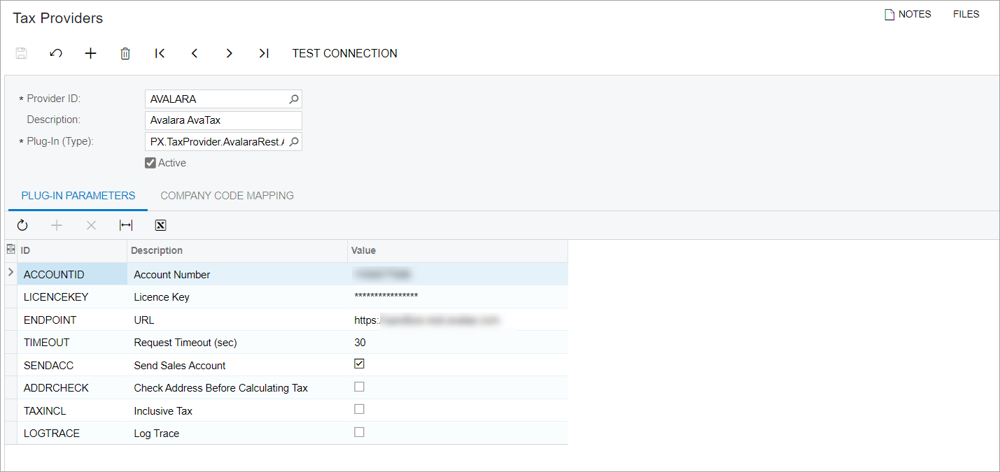

# Exception Certificate Management: Configuration Workflow {#_775fa1c0-64d6-43d5-8016-b37fe2a63d6c .concept}

Before you start to add customers to the Avalara exception certificate management \(ECM\) account and request exempt certificates for them, you should be sure that the needed feature has been enabled in Acumatica ERP, settings have been specified, and entities have been configured, as described in the following sections of this topic.

**Important:** Before the exemption certificate management functionality can be configured, integration with Avalara must be configured in Acumatica ERP, and the ECM tax provider account must be created in Avalara. For details, see [Setup of Online Integration with Avalara AvaTax](TX__con_Integrating_with_AvaTax.md).

## Configuring the Integration with the Avalara ECM Provider {#section_hsq_mym_rcc .section}

**Tip:** Before configuring the Avalara ECM in Acumatica ERP, ensure that your company's ECM provider account has been configured in Avalara and that integration with Avalara has been set up in Acumatica ERP.

To configure the Avalara exemption certificate management in Acumatica ERP, you perform the following general steps:

1.  You enable the *Exemption Certificate Management* feature on the [Enable/Disable Features](CS_10_00_00.md) \(CS100000\) form.
2.  You configure the Avalara ECM provider on the [Tax Providers](TX_10_20_00.md) \(TX102000\) form.
3.  You specify the Avalara ECM provider in the **ECM Provider** box on the [Tax Preferences](TX_10_30_00.md) \(TX103000\) form.

These steps are described in detail in the following sections of this topic.

Once all the listed steps are completed, you can add the Acumatica ERP tax-exempt customers to the ECM provider account and request the exemption certificates from the customers. For details, see [Exception Certificate Management: General Information](config_Exception_Certificate_Management_GeneralInfo.md).

## Enabling the Exemption Certificate Management Feature {#section_kgn_rym_rcc .section}

On the [Enable/Disable Features](CS_10_00_00.md) \(CS100000\) form, the *Exemption Certificate Management* feature should be enabled. To enable the feature, you click **Modify** on the form toolbar and then select the **Exemption Certificate Management** check box, which is located under **External Tax Calculation Integration** in the *Third-Party Integrations* group of features. On the form toolbar, you click **Enable**.

Once the *Exemption Certificate Management* feature is enabled, all UI elements related to the exemption certificate management become available for users with the appropriate access rights, such as *Admin*, *Acumatica Support*, *TX Admin*, *AR Admin*, and *AR Clerk*.

## Configuring the Tax Provider { .section}

On the [Tax Providers](TX_10_20_00.md) \(TX102000\) form, the Avalara tax provider has to be configured, as shown in the following screenshot. See [Setup of Online Integration with Avalara AvaTax](TX__con_Integrating_with_AvaTax.md) for information about how to perform this configuration.

In the Summary area of the form, in the **Plug-In \(Type\)** box, the *PX.TaxProvider.AvalaraRest.AvalaraRestTaxProvider* plug-in type should be selected for the Avalara ECM tax providers.

## Specifying the ECM Tax Provider in Acumatica ERP { .section}

On the [Tax Preferences](TX_10_30_00.md) \(TX103000\) form, the Avalara ECM tax provider should be specified in the **ECM Provider** box of the **ECM Settings** section.

**Parent topic:**[Configuring Exception Certificate Management with Avalara](../UserGuide/config_Exception_Certificate_Management_Mapref.md)

