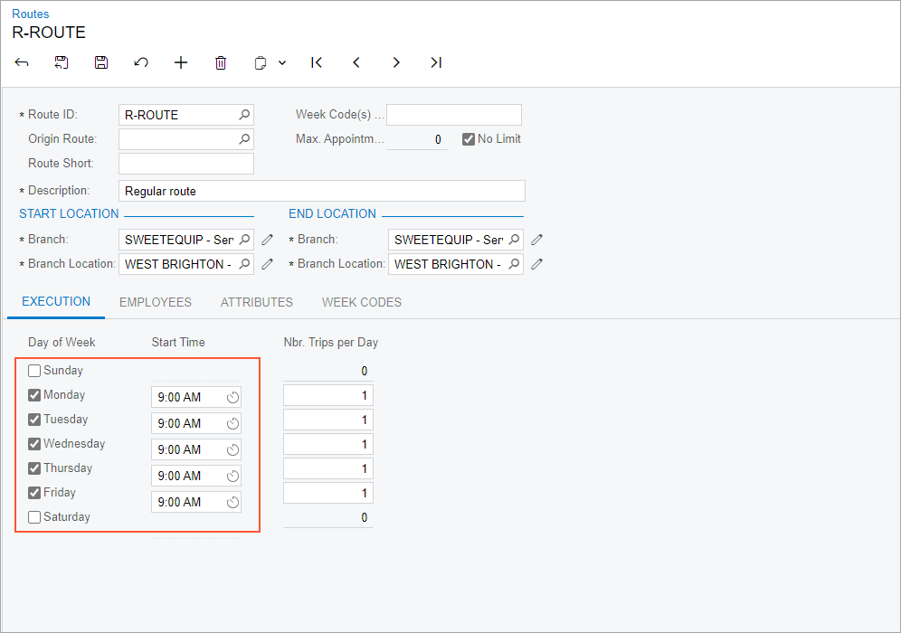

# Routes: To Create Routes {#_8913cbb7-f74a-420b-bdeb-3eeaea2a75a7 .task}

In Acumatica ERP, a *route* contains common settings for multiple route executions performed by your company. These settings include the starting and ending locations of the route, the schedule when it can be performed, and the employees \(drivers\) who can be assigned to execute the route. Each route execution is tied to a particular day, a particular driver, a specific vehicle, and particular appointments and services. The route, conversely, is a template with only the settings that will be common to all executions of a route.

## Story {#section_cgk_1y1_ldc .section}

Suppose that the SweetLife Service and Equipment Sales Center plans to provide services on two routes, each of which has its own schedule. Acting as an administrative user, you will create two routes. The first route \(*ROUTE*\) can be executed on any working day by either of two drivers in your company. The second route \(*TU-ROUTE*\) can be executed only on Tuesdays, starting no earlier than 01:00 PM.

## Process Overview {#section_x3b_tzh_ldc .section}

On the [Routes](FS_20_37_00.md) \(FS203700\) form, you will create two routes with distinct settings.

## System Preparation {#section_xyr_cbv_3dc .section}

Before you start creating routes, do the following:

1.  On the Acumatica ERP website, sign in to a company with the *U100* dataset preloaded as a system administrator by using the *gibbs* username and the *123* password.
2.  On the Company and Branch Selection menu on the top pane of the Acumatica ERP screen, select the *SWEETEQUIP - Service and Equipment Sales Center* branch.

## Step: Creating Two Routes {#section_iwb_cy1_ldc .section}

Perform the following instructions:

1.  On the Company and Branch Selection menu on the top pane of the Acumatica ERP screen, ensure that the *SWEETEQUIP - Service and Equipment Sales Center* branch is selected.
2.  On the [Routes](FS_20_37_00.md) \(FS203700\) form, create a new route and specify the following settings:
    -   **Route ID**: `R-ROUTE`
    -   **Description**: `Regular route`
3.  Under **Start Location**, in the **Branch Location** box, select *WEST BRIGHTON*.
4.  Under **End Location**, in the **Branch Location** box, select *WEST BRIGHTON*.
5.  On the **Execution** tab, select the **Monday**, **Tuesday**, **Wednesday**, **Thursday**, and **Friday** check boxes, and leave the other check boxes cleared, as shown in the following screenshot.
6.  In the **Start Time** column for all the selected days of the week, select *9:00 AM*, which is also shown in the following screenshot.

    

7.  On the **Employees** tab, add two rows with the following employees selected in the **Employee ID** column:

    -   *EP00000005 \(Peter Lai\)*
    -   *EP00000045 \(Luke Cole\)*
    Notice that only the staff members with the *Driver* skill can be selected on this tab. Also notice that the priority of each of the employees is *1*.

8.  In the **Priority Preference** column, change the priority of Luke Cole to `2`.
9.  Save your changes.
10. On the form toolbar, click **Add New Record** and specify the following settings for the second route:
    -   **Route ID**: `TU-ROUTE`
    -   **Description**: `Tuesday route`
11. Under **Start Location**, in the **Branch Location** box, select *WEST BRIGHTON*.
12. Under **End Location**, in the **Branch Location** box, select *WEST BRIGHTON*.
13. On the **Execution** tab, select the **Tuesday** check box and leave the other check boxes cleared.
14. In the **Start Time** box of the selected day of week, select *1:00 PM*.
15. On the **Employees** tab, add two rows with the following settings in the **Employee ID** column:
    -   *EP00000005 \(Peter Lai\)*
    -   *EP00000045 \(Luke Cole\)*
16. Save your changes.

You have created two routes in the system. Now you can create route executions and select these routes, and the system will fill in the appropriate settings.

**Parent topic:**[Managing Routes](../UserGuide/RouteMgmt_Managing_Routes_Mapref.md)

