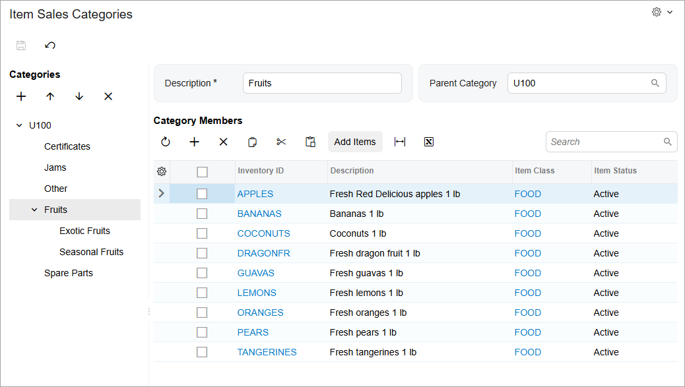
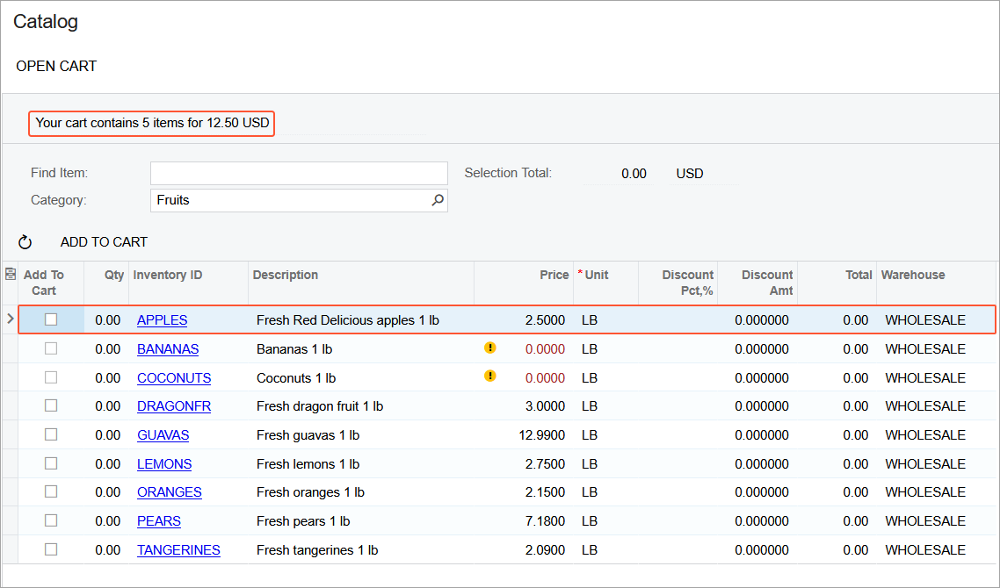

# Managing the Inventory Catalog in the Self-Service Portal: Implementation Activity {#_3a5e538f-b5a4-4d69-9068-b7cdc99c3448 .task}

In the following implementation activity, you will set up the Acumatica Self-Service Portal for your customers to order online. You will also learn how to manage your online catalog in Acumatica ERP.

## Story { .section}

Suppose that you are Kimberly Gibbs, system administrator at the SweetLife Fruits &amp; Jams company. You need to configure the Self-Service Portal to provide your customers with access to the products that SweetLife sells.

In your Acumatica ERP instance, you need to create new sales categories, add new items to these categories, which gives customers the ability to order these items in the Self-Service Portal.

## Configuration Overview { .section}

For the purposes of this activity, the following tasks have been performed:

-   The Acumatica ERP application instance with the *U100\_SSP\_Admin\_2026 R1* dataset preloaded and the Self-Service Portal application instance have been deployed in the same database.

    **Tip:** This deployment is outside of the scope of this training.

-   In the *U100\_SSP\_Admin\_2026 R1* dataset, on the [User Roles](SM_20_10_05.md) \(SM201005\) form of Acumatica ERP, the *Portal Admin* role has been assigned to the *gibbs* user account. The user account is associated with Kimberly Gibbs, the system administrator in the SweetLife Fruits &amp; Jams company. The role provides full administrative privileges in the Self-Service Portal.
-   On the [Item Classes](IN_20_10_00.md) \(IN201000\) form, the *FOOD* and *JCRCFGPRT* \(parts of configurable juicers\) item classes have been defined.
-   On the [Item Sales Categories](IN_20_40_60.md) \(IN204060\) form, a few sales categories have been created, including the *Certificates* category.
-   On the [Stock Items](IN_20_25_00.md) \(IN202500\) form, the inventory items of the *FOOD* and *JCRCFGPRT* \(parts of configurable juicers\) item classes have been created.

## Process Overview { .section}

In this activity, you will do the following:

1.  Sign in to Acumatica ERP. In Acumatica ERP, on the [Enable/Disable Features](CS_10_00_00.md) \(CS100000\) form, you will enable the features needed for order management and inventory catalog.
2.  In the Self-Service Portal, on the Portal Preferences \(SP800000\) form, specify the settings for order management and the inventory catalog.
3.  In Acumatica ERP, do the following:
    1.  On the [Stock Items](IN_20_25_00.md) \(IN202500\) form, you will add a description and an image to an inventory item.
    2.  On the [Item Sales Categories](IN_20_40_60.md) \(IN204060\) form, you will create and manage sales categories for inventory items, add items to sales categories, and remove an item from a sales category.
4.  Sign in to the Self-Service Portal. On the Catalog \(SP700000\) form, you will verify that the catalog contains the newly added items. Then you will verify that inventory catalog in the Self-Service Portal has been correctly configured.

## System Preparation { .section}

Before you start configuring the order management and inventory catalog in the Self-Service Portal, do the following:

1.  Launch the Acumatica ERP instance with the *U100\_SSP\_Admin\_2026 R1* dataset preloaded.
2.  Sign in as system administrator Kimberly Gibbs by using the *gibbs* username and the *123* password.
3.  In Acumatica ERP, make sure that on the [Business Accounts](CR_30_30_00.md) \(CR303000\) form, for the *STOREHUT* business account, *STORE* is selected in the **Business Account Class** box.
4.  Make sure that you have performed the following prerequisite activities:
    1.  [Configuring the Self-Service Portal: To License the Self-Service Portal Instance](config_SSP_Admin_To_License_SSP_Instance.md)
    2.  [Configuring the Self-Service Portal: To Specify the General Settings of the Self-Service Portal](config_SSP_Admin_To_Specify_General_Settings_of_Instance.md)
    3.  [Managing Access to the Self-Service Portal: To Create User Roles for a Customer’s Employees](config_SSP_Admin_Managing_Access_to_SSP_Create_Roles_for_Customer_Employees.md)
    4.  [Managing Access to the Self-Service Portal: To Create User Types for User Accounts](config_SSP_Admin_Managing_Access_to_SSP_To_Create_User_Type_SSP.md)
    5.  [Managing Access to the Self-Service Portal: To Create User Accounts for Contacts](config_SSP_Admin_Access_to_SSP_Add_User_Account_for_Contact.md)
5.  Download the [red\_delicious.jpg](Files/red_delicious.jpg) and [sweetlife.jpg](Files/sweetlife.jpg) files.

**Attention:**

To be sure that the needed workspaces, forms, reports, and dashboards will be available in the Self-Service Portal, before completing the activity, add the following key to the `appSettings` section of the `web.config` file located in the folders of the Acumatica ERP and Self-Service Portal websites.

```
<add key="IsMultiSiteMode" value="true" />
```

You should also reload the webpages of the Acumatica ERP instance and the Self-Service Portal. Synchronization of the Acumatica ERP and Self-Service Portal instances may take some time.

## Step 1: Enabling the Needed Features { .section}

To enable the features needed for order management and inventory catalog, in Acumatica ERP, do the following:

1.  Open the [Enable/Disable Features](CS_10_00_00.md) \(CS100000\) form.
2.  On the form toolbar, click **Modify**.
3.  Under the *Customer Portal* group of features, select the following check boxes:
    -   **B2B Ordering**
    -   **Financials on Portal**
4.  On the form toolbar, click **Enable** to enable the features.

## Step 2: Specifying the Settings for Order Management in the Self-Service Portal { .section}

To specify the settings for online order management in the Self-Service Portal, do the following:

1.  Launch the Self-Service Portal instance that uses the same database as the Acumatica ERP instance. You should sign in as system administrator by using the *gibbs* username and the *123* password.
2.  Open the Portal Preferences \(SP800000\) form.
3.  In the **General Settings** section of the **B2B Ordering Settings** tab, do the following:
    1.  In the **Default Branch for New Orders** box, select *HEADOFFICE*.
    2.  In the **Sales Order Type** box, make sure that *SO* is selected.

        This value determines the type of a sales order to be generated when a customer creates a sales order in the Self-Service Portal.

4.  In the table, in the **Include in Warehouses List** column, select the check box in the row that has *WHOLESALE* in the **Warehouse ID** column.
5.  On the form toolbar, click **Save**.
6.  In the **General Settings** section, do the following:
    1.  In the **Default Stock Item Warehouse** box, select *WHOLESALE*, which is the warehouse to be used by default for ordering stock items.
    2.  In the **Default Non-Stock Item Warehouse** box, select *WHOLESALE*. This warehouse will be used by default for ordering non-stock items.
    3.  Clear the **Show Available Quantities** check box. This setting causes the quantities of items available in the warehouses to be displayed in the catalog on the Catalog \(SP700000\) form. You do not need the customers to see these quantities.
    4.  Make sure that the **Allow Only Sales Unit for Purchase** check box is selected. With this setting, items can be added to the purchase orders in only the unit of measure \(UOM\) that has been specified as the sales unit in the item's settings on the [Stock Items](IN_20_25_00.md) \(IN202500\) or [Non-Stock Items](IN_20_20_00.md) \(IN202000\) form.
7.  In the **Default Image Settings** section, upload the image to be used as the default image when an inventory item does not have any images attached. Do the following:
    1.  Click **Browse**.
    2.  Select the `sweetlife.jpg` file, which you have downloaded while preparing the system.
    3.  Click **Upload**.
8.  On the form toolbar, click **Save**.
9.  Sign out of the Self-Service Portal.

## Step 3: Adding the Description and the Image for an Inventory Item { .section}

If descriptions and images have been added for the inventory items in Acumatica ERP, customers can view these descriptions and images in the online catalog on the Catalog \(SP700000\) form of the Self-Service Portal.

To add the description and the image for the *APPLES* inventory item, do the following:

1.  In Acumatica ERP, sign in to the system as system administrator by using the *gibbs* username and the *123* password.
2.  On the [Stock Items](IN_20_25_00.md) \(IN202500\) form, open the *APPLES* record.
3.  In the **Description** box, update the description by typing `Fresh Red Delicious apples 1 lb`.
4.  Add the image to the stock item by doing the following:
    1.  On the **Attributes** tab, right of the **Image** box, click **Browse**.
    2.  Select the `red_delicious.jpg` file, which you have downloaded earlier.
    3.  Click **Upload** to add the image to the stock item record.

        **Tip:** The images that you upload on the **Attributes** tab of the [Stock Items](IN_20_25_00.md) form are displayed in the **Item Details** dialog box in the online catalog on the Catalog \(SP700000\) form of the Self-Service Portal, which a user can open by clicking the link in the **Inventory ID** column.

5.  On the form toolbar, click **Save**.

## Step 4: Creating New Sales Categories and Subcategories for Inventory Items { .section}

To add new sales categories and subcategories to be used for inventory items in the catalog, do the following:

1.  While you are still signed in to Acumatica ERP, open the [Item Sales Categories](IN_20_40_60.md) \(IN204060\) form.
2.  Create the *Fruits* sales category as follows:
    1.  In the **Categories** pane, click the tenant name.
    2.  On the **Categories** pane toolbar, click **Add Category**.
    3.  At the top of the right pane, in the **Description** box, type `Fruits` \(the name of the new category\).
    4.  On the form toolbar, click **Save**.
3.  Create the *Spares* sales category as follows:
    1.  In the **Categories** pane, click the tenant name.
    2.  On the **Categories** pane toolbar, click **Add Category**.
    3.  At the top of the right pane, in the **Description** box, type `Spares`.
    4.  On the form toolbar, click **Save**.
4.  Create the subcategories of the *Fruits* category as follows:
    1.  In the **Categories** pane, click *Fruits*.
    2.  On the pane toolbar, click **Add Category**.
    3.  At the top of the right pane, in the **Description** box, type `Exotic Fruits`.
    4.  On the form toolbar, click **Save**.
    5.  In the **Categories** pane, click *Fruits*.
    6.  On the pane toolbar, click **Add Category**.
    7.  At the top of the right pane, in the **Description** box, type `Seasonal Fruits`.
    8.  On the form toolbar, click **Save**.

## Step 5: Renaming a Sales Category { .section}

You can rename sales categories for inventory items by changing their descriptions.

While you are still viewing the [Item Sales Categories](IN_20_40_60.md) \(IN204060\) form, to rename the *Spares* category \(which you created in the previous step\), do the following:

1.  In the **Categories** pane, click the *Spares* category.
2.  In the right pane, in the **Description** box, type `Spare Parts`.
3.  On the form toolbar, click **Save**.

## Step 6: Rearranging Sales Categories { .section}

You can rearrange sales categories for inventory items by changing their order in the list of categories. Suppose that you need to place the *Certificates* category to the highest position for better visibility.

To rearrange the categories, do the following:

1.  While you are still viewing the [Item Sales Categories](IN_20_40_60.md) \(IN204060\) form, in the **Categories** pane, click the *Certificates* category \(which has been predefined in the *U100\_SSP\_Admin\_2026 R1* dataset\).
2.  On the pane toolbar, click **Move Node Up** to change the position of the category in the list. Click **Move Node Up** until the *Certificates* category is the first listed category.
3.  On the form toolbar, click **Save**.

## Step 7: Adding Inventory Items to the Sales Categories { .section}

Your customers can view and add to their cart items from the online catalog on the Catalog \(SP700000\) form of the Self-Service Portal if these inventory items have been added to sales categories in Acumatica ERP.

To add inventory items to sales categories, do the following:

1.  While you are still viewing the [Item Sales Categories](IN_20_40_60.md) \(IN204060\) form, in the **Categories** pane, click the *Fruits* category, to which you will add inventory items.
2.  Add an inventory item to the *Fruits* category as follows:
    1.  In the right pane, on the table toolbar of the **Category Members** table, click **Add Row**.
    2.  In the **Inventory ID** column, select the *GINGER* item.
3.  Add all inventory items of the *FOOD* item class to the *Fruits* category as follows:
    1.  In the right pane, on the table toolbar of the **Category Members** table, click **Add Items**.
    2.  In the **Add Items** dialog box, which opens, do the following:
        1.  In the **Add Items** box, select *By Class*.
        2.  In the **Item Class** box, select *FOOD*.
        3.  Click **Add** to add the items to the category and close the dialog box.
4.  Add all inventory items of the *JCRCFGPRT* \(parts of configurable juicers\) item class to the *Spare Parts* category as follows:
    1.  In the left pane, click the *Spare Parts* category, to which you will add inventory items.
    2.  In the right pane, on the table toolbar of the **Category Members** table, click **Add Items**.
    3.  In the **Add Items** dialog box, which opens, do the following:

        1.  In the **Add Items** box, select *By Class*.
        2.  In the **Item Class** box, select *JCRCFGPRT*.
        3.  Click **Add** to add the items to the category and close the dialog box. The system saves your changes automatically.
        **Tip:** You can add an inventory item to multiple categories, if needed.


## Step 8: Removing an Inventory Item from the Catalog { .section}

If you remove an item from a particular sales category, it will no longer be shown under that category in the Self-Service Portal. To remove an item from a category, do the following:

1.  While you are still viewing the [Item Sales Categories](IN_20_40_60.md) \(IN204060\) form, in the **Categories** pane, select the *Fruits* category, from which you want to remove the *GINGER* item.
2.  In the right pane, in the **Category Members** table, select the unlabeled check box in the row with the *GINGER* item.
3.  On the table toolbar, click **Delete Row**.
4.  On the form toolbar, click **Save**.

    You can see the modified list of sales categories for inventory items in the following screenshot.

    

5.  Sign out of the system.

## Step 9: Reviewing the Inventory Catalog in the Self-Service Portal { .section}

To verify that the changes you have made to the sales categories are reflected in the catalog in the Self-Service Portal, do the following:

1.  Sign in to the Self-Service Portal as Tonya Lawrence by using the *tonya@storehut.example.com* username and the *123* password.
2.  In the **Orders** workspace, click **Catalog**. The Catalog \(SP700000\) form opens.
3.  In the **Category** box of the Selection area, click the magnifier button to open the list of sales categories for inventory items.
4.  Make sure that you can see the *Fruits* and *Spare Parts* categories, which you have added in this activity. In the *Fruits* category, make sure that you can see the *Exotic Fruits* and *Seasonal Fruits* subcategories, which you have also created.
5.  Double-click *Fruits*. The system inserts the value in the **Category** box and closes the list of sales categories.
6.  In the table, make sure that you can see the inventory items that you have added in this activity \(except *GINGER*, which you have deleted\).
7.  In the **Inventory ID** column, click the *APPLES* link. In the **Item Details** dialog box, which opens, view the image that you have uploaded in this activity. Close the dialog box.
8.  In the row that has *APPLES* in the **Inventory ID** column and *Fresh Red Delicious apples 1 lb* in the **Description** column, do the following:

    -   In the **Qty.** column, type `5`.
    -   Select the **Add to Cart** check box.
    Notice that the description is the updated one you specified earlier in the activity.

9.  On the table toolbar, click **Add to Cart**. Under the form toolbar, notice that a message about the item in the cart is shown. \(See the following screenshot.\)

    


You have reviewed the catalog of inventory items in the Self-Service Portal.

**Parent topic:**[Managing the Inventory Catalog in the Self-Service Portal](../UserGuide/config_SSP_Admin_Managing_Inventory_Catalog_Mapref.md)

