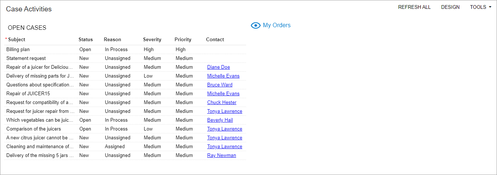
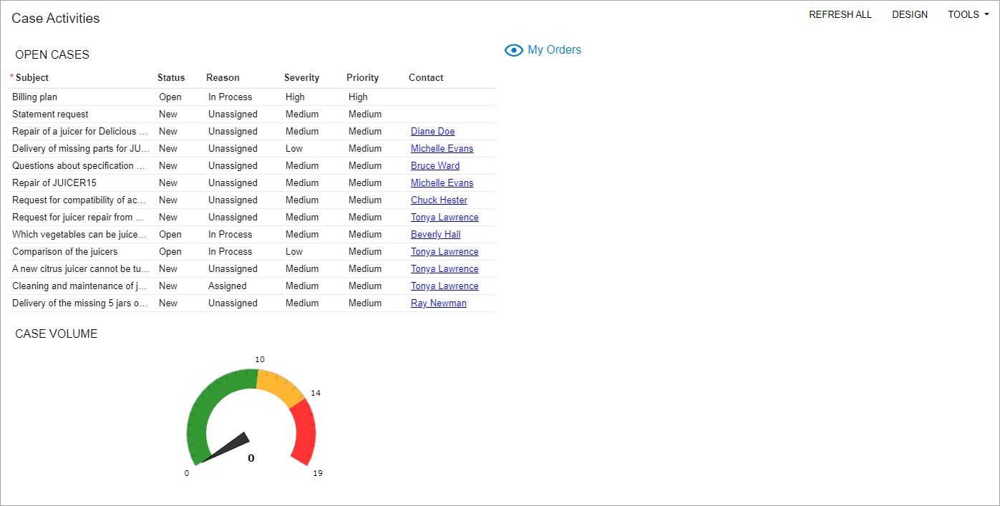
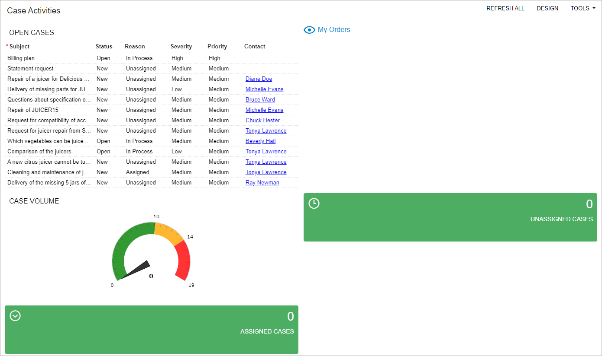
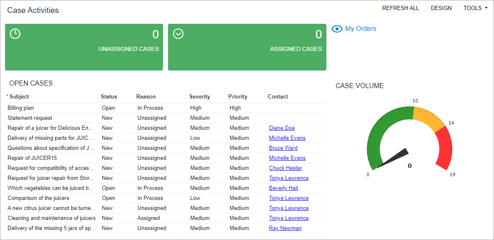

# Tailoring the Self-Service Portal: To Create and Design a Dashboard {#_aae37e91-0ffb-407d-a4d4-af3d8fbbcfd9 .task}

In the following implementation activity, you will configure a dashboard in the Acumatica Self-Service Portal.

## Story { .section}

Suppose that you are Kimberly Gibbs, system administrator who also handles dashboards at the SweetLife Fruits &amp; Jams company. You need to create the new *Case Activities* dashboard based on a request from a SweetLife customer, the Storehut chain of supermarkets in New York. On the dashboard, the customer's managers should be able to monitor cases reported to SweetLife and have quick access to orders.

## Configuration Overview { .section}

For the purposes of this activity, the following tasks have been performed:

-   The Acumatica ERP application instance with the *U100\_SSP\_Admin\_2026 R1* dataset preloaded and the Self-Service Portal application instance have been deployed in the same database.

    **Tip:** This deployment is outside of the scope of this training.

-   In the *U100\_SSP\_Admin\_2026 R1* dataset, on the [User Roles](SM_20_10_05.md) \(SM201005\) form of Acumatica ERP, the *Portal Admin* role has been assigned to the *gibbs* user account. The user account is associated with Kimberly Gibbs, the system administrator in the SweetLife Fruits &amp; Jams company. The role provides full administrative privileges in the Self-Service Portal.

## Process Overview { .section}

In this activity, you will do the following:

1.  Create the *Case Activities* dashboard
2.  Set up user access rights to the dashboard
3.  Add the *Data Table*, *Link*, and *KPI* widgets to the dashboard
4.  Select the dashboard layout template
5.  Verify that the dashboard has been correctly configured

**Tip:** The dashboard configuration shown in the screenshots in this activity may slightly differ in its layout from the dashboards that you configure in your system. These differences do not affect the process flow.

## System Preparation { .section}

Before you start creating and designing a dashboard in the Self-Service Portal, do the following:

1.  Sign in to Acumatica ERP as system administrator Kimberly Gibbs by using the *gibbs* username and the *123* password.
2.  On the [Enable/Disable Features](CS_10_00_00.md) \(CS100000\) form, make sure that the following features have been enabled:
    -   *Customer Portal*
    -   *B2B Ordering*
    -   *Case Management on Portal*
    -   *Financials on Portal*
3.  Make sure that you have performed the following prerequisite activities:
    1.  [Configuring the Self-Service Portal: To License the Self-Service Portal Instance](config_SSP_Admin_To_License_SSP_Instance.md)
    2.  [Configuring the Self-Service Portal: To Specify the General Settings of the Self-Service Portal](config_SSP_Admin_To_Specify_General_Settings_of_Instance.md)
    3.  [Managing Access to the Self-Service Portal: To Create User Roles for a Customer’s Employees](config_SSP_Admin_Managing_Access_to_SSP_Create_Roles_for_Customer_Employees.md)
    4.  [Managing Access to the Self-Service Portal: To Create User Types for User Accounts](config_SSP_Admin_Managing_Access_to_SSP_To_Create_User_Type_SSP.md)
    5.  [Managing Access to the Self-Service Portal: To Create User Accounts for Contacts](config_SSP_Admin_Access_to_SSP_Add_User_Account_for_Contact.md)
    6.  [Managing the Inventory Catalog in the Self-Service Portal: Implementation Activity](config_SSP_Admin_Managing_Inventory_Catalog_Implem_Activity.md)
    7.  [Configuring Case Management in the Self-Service Portal: Implementation Activity](config_SSP_Admin_Configuring_Case_Management_in_SSP_Implem_Activity.md)
    8.  [Tailoring the Self-Service Portal: To Create a Generic Inquiry](config_SSP_Admin_Tailoring_SSP_To_Create_a_Generic_Inquiry.md)
4.  Launch the Self-Service Portal website with the *U100\_SSP\_Admin\_2026 R1* dataset preloaded.
5.  Sign in to the system as system administrator by using the *gibbs* username and the *123* password.

## Step 1: Creating a Dashboard { .section}

To create the *Case Activities* dashboard, do the following:

1.  In the Self-Service Portal, open the [Classic Dashboards](SM_20_86_00.md) \(SM208600\) form.
2.  In the Summary area, do the following:
    1.  In the **Name** box, type `Case Activities`.
    2.  In the **Owner Role** box, select *Portal Admin*.
    3.  Clear the **Allow Users to Personalize** check box. Portal users should not be given the ability to make personalized copies of the dashboard.
3.  On the form toolbar, click the **Publish to the UI** button. The **Publish to the UI** dialog box opens.
4.  In the dialog box, specify the following settings:
    1.  **Site Map Title**: `Case Activities`
    2.  **Workspace**: `Other`
    3.  **Category**: *Dashboards*
5.  In the **Access Rights** section of the dialog box, select the **Set to Granted for All Roles** option button.
6.  Click **Publish** to complete the publication process.

You have created an empty dashboard. In the next step, you will set up access rights for users to this dashboard.

**Tip:** The system assigns the dashboard an automatically generated ID in a format similar to that of the screen IDs of other dashboards, with *DB* as the two-letter module code: *DB000000*. When the ID is assigned, the system adds the dashboard to the site map. Because a workspace and category have been specified, a user with the *Portal Admin* role can access the dashboard through the workspace.

## Step 2: Setting Up User Access Rights for an Administrator to the Dashboard { .section}

Now you need to change the access rights to the dashboard so that users with the *Portal Admin* role can add widgets to the dashboard and users with *Customer Admin* and *Customer User* roles can view the dashboard.

While you are still viewing the *Case Activities* dashboard on the [Classic Dashboards](SM_20_86_00.md) \(SM208600\) form in the Self-Service Portal, do the following:

1.  On the **Visible To:** tab, in the rows that have *Portal Admin*, *Customer Admin*, and *Customer User* in the **Role** column, make sure that *Granted* is selected in the **Access Rights** column.

    **Tip:** You can type the name of the role into the Search box in the lower part of the tab to quickly find the role.

2.  On the form toolbar, click **View**. The *Case Activities* dashboard opens. The dashboard is empty because you have not yet added any widgets to it.
3.  On the dashboard title bar, make sure that the **Design** button is displayed. This indicates that the user can modify the dashboard.

You have set up access rights for the Self-Service Portal administrator and users and verified that you have correctly set up the access rights for the administrator. Now you can populate the dashboard with widgets, which you will do in the next steps of this activity.

## Step 3: Adding a Data Table Widget to the Dashboard { .section}

To add a *Data Table* widget to the dashboard in the Self-Service Portal, do the following:

1.  While you are still viewing the *Case Activities* dashboard, on the dashboard title bar, click the **Design** button to switch to design mode.
2.  In the widget placeholder in the upper part of the screen, click *Add a new widget*. The **Add Widget** dialog box opens.
3.  In the **Add Widget** dialog box, click **Data Table**.
4.  Click **Next**.
5.  In the **Inquiry Screen** box of the **Widget Properties** dialog box, which opens, click the magnifier button. The lookup table opens.
6.  In the Search box, type `cases`.
7.  In the **Title** column, double-click *Open Cases*, which closes the lookup table and fills in the **Inquiry Screen** box of the dialog box.
8.  Click **Inquiry Parameters**.
9.  In the **Inquiry Parameters** dialog box, which opens, do the following:
    1.  Clear the **Me** check box.
    2.  Click **OK**.
10. In the **Widget Properties** dialog box \(which you return to after closing the **Inquiry Parameters** dialog box\), select the **Automatically Adjust Height** check box.
11. Click **Column Settings**.
12. In the **Column Settings** dialog box, which opens, move columns from the **Selected Columns** list to the **Available Columns** list by selecting each needed column and then clicking the arrow pointing left. The **Selected Columns** list should contain only the following columns:
    -   **Subject**
    -   **Status**
    -   **Reason**
    -   **Severity**
    -   **Priority**
    -   **Contact**
13. Click **OK**. The **Column Settings** dialog box is closed.
14. In the **Caption** box of the **Widget Properties** dialog box \(to which you return\), type `open cases` to specify the title of the widget.
15. Click **Finish** to create the widget with the settings you have specified, save it, and add it to the dashboard.
16. On the dashboard title bar, click the **Design** button to switch to view mode.

## Step 4: Adding a Link Widget to the Dashboard { .section}

To add a *Link* widget to the dashboard in the Self-Service Portal, do the following:

1.  While you are still viewing the *Case Activities* dashboard, on the dashboard title bar, click the **Design** button to switch to design mode.
2.  In the widget placeholder in the right part of the screen, click *Add a new widget*. The **Add Widget** dialog box opens.
3.  In the dialog box, click **Link**.
4.  Click **Next**.
5.  In the **Widget Properties** dialog box, which opens, do the following:
    1.  In the **Icon** box, select the *visibility* icon, which will be displayed in the widget.

        **Tip:** You can begin typing the name of the icon into the box to quickly find the icon.

    2.  In the **Form** box, do the following:
        1.  Click the magnifier button.
        2.  In the lookup table that opens, in the Search box, type `orders`.
        3.  In the **Title** column, double-click *My Orders*, which closes the lookup table and fills in the **Form** box of the dialog box.
    3.  In the **Caption** box, type `My Orders`.
    4.  Click **Finish** to save your changes and close the dialog box.

        The widget is added to the workspace.

6.  On the dashboard title bar, click the **Design** button to switch to view mode.

You can see the *Case Activities* dashboard with the *Open Cases* and *My Orders* widgets in the following screenshot.

## Step 5: Adding a KPI Widget of the Meter Visualization Type to the Dashboard { .section}

In this step, in the Self-Service Portal, you will create a *Key Performance Indicator \(KPI\)* widget based on the *All Cases* generic inquiry. This widget will display the total number of cases and their level in the number of cases. To add the *KPI* widget to the dashboard, do the following:

1.  While you are still viewing the *Case Activities* dashboard, on the dashboard title bar, click the **Design** button to switch to design mode.
2.  In the widget placeholder in any part of the screen, click *Add a new widget*. The **Add Widget** dialog box opens.
3.  In the dialog box, click **Key Performance Indicator \(KPI\)**.
4.  Click **Next**.
5.  In the **Widget Properties** dialog box, which opens, do the following:
    1.  In the **Inquiry Screen** box, select the *All Cases* inquiry, which will be used as a base for the widget.
    2.  In the **Field to Aggregate** box, select *Case ID*.
    3.  In the **Aggregate Function** box, make sure the *Count All* is selected.
    4.  In the **Normal Level Type** box, leave the default *Fixed Value*.
    5.  In the **Normal Level** box, specify `10`.
    6.  In the **Alarm Level Type** box, select *Percent Value*.
    7.  In the **Alarm Level** box, specify `140`.
    8.  Define the colors as follows:
        -   **Normal Color**: *Green*
        -   **Warning Color**: *Orange*
        -   **Alarm Color**: *Red*
    9.  In the **Visualization Type** box, select *Meter*.
    10. In the **Caption** box, type `case volume`.
    11. Click **Finish** to save your changes and close the dialog box.

        The widget is added to the workspace.

6.  On the dashboard title bar, click the **Design** button to switch to view mode.

You can see the *Case Activities* dashboard with the *Case Volume* widget in the following screenshot.

## Step 6: Adding KPI Widgets of the Scorecard Visualization Type to the Dashboard {#section_lr5_qm1_zpb .section}

In this step, in the Self-Service Portal, you will create two *Key Performance Indicator \(KPI\)* widgets based on the *All Cases* generic inquiry.

You will create the *Case Volume* widget and change the parameters of new widgets. To add *KPI* widgets to the dashboard, do the following:

1.  While you are still viewing the *Case Activities* dashboard, on the dashboard title bar, click the **Design** button to switch to design mode.
2.  Point at the *Case Volume* widget and on the widget title bar, click the Clipboard button to copy the settings of the widget.
3.  In the widget placeholder in any part of the screen, click *Paste from clipboard*. The system inserts the copied widget.
4.  On the title bar of the created widget, click the Edit button. The **Widget Properties** dialog box opens.
5.  Click the **Filter Settings** button.
6.  In the **Filter Settings** dialog box, which opens, do the following:
    1.  On the table toolbar, click **Add Row**.
    2.  In the **Data Field** column of the added row, select *Status*.
    3.  In the **Conditions** column leave the default value: *Equals*.
    4.  In the **Value 1** column, select *New*.
    5.  On the table toolbar, click **Add Row**.
    6.  In the **Data Field** column of the added row, select *Reason*.
    7.  In the **Conditions** column leave the default value: *Equals*.
    8.  In the **Value 1** column, select *Unassigned*.
    9.  Click **OK** to save your changes.
7.  In the **Normal Level** box, specify `2`.
8.  In the **Visualization Type** box, select *Scorecard*.
9.  In the **Icon** box, select *access time*.
10. In the **Caption** box, type `unassigned cases`.
11. Click **Finish** to save your changes and close the dialog box.

    The widget is added to the dashboard.

12. Point at the *Unassigned Cases* widget and on the widget title bar, click the Clipboard button to copy the settings of the widget.
13. In the widget placeholder in any part of the screen, click *Paste from clipboard*. The system inserts the copied widget to the dashboard.
14. On the title bar of the created widget, click the Edit button. The **Widget Properties** dialog box opens.
15. Click the **Filter Settings** button.
16. In the **Filter Settings** dialog box, which opens, do the following:
    1.  In the row with *Reason*, change **Value 1** column, select *Assigned*.
    2.  Click **OK** to save your changes.
17. In the **Icon** box, select *arrow drop down circle*.
18. In the **Caption** box, type `assigned cases`.
19. Click **Finish** to save your changes and close the dialog box.

    The widget is added to the dashboard.

20. On the dashboard title bar, click the **Design** button to switch to view mode.

You can see the dashboard with the *KPI* widgets in the following screenshot.

## Step 7: Selecting a Template for the Dashboard Layout { .section}

Suppose that you want to arrange the widgets on the dashboard so that the left column takes two-thirds of the width of the working area. With this layout, the *Open Cases* widget on the dashboard will be larger and easier to see and the *My Orders* widget will be smaller. Further suppose that you want to place the *Unassigned Cases* and *Assigned Cases* widgets above the *Open Cases* widget and the *Case Volume* widget under the *My Orders* widget.

To select a dashboard layout template, do the following:

1.  While you are still viewing the *Case Activities* dashboard in view mode, click the **Design** button on the dashboard title bar to switch to design mode.
2.  On the dashboard title bar, click the **Edit Layout** button.
3.  In the **Dashboard Layouts** dialog box, which opens, do the following:
    1.  Select the layout template that has a wide left column \(two-thirds of the working area\) and a narrow right column \(one-third of the working area\).
    2.  Click **OK**. The dialog box is closed, and the dashboard widgets are arranged within the selected layout.
4.  Drag the *My Orders* widget to the right.
5.  Drag the right border of the *Open Cases* widget to the right so that the widget takes two-thirds of the working area.

    **Tip:** If the content of each widget's column is not fully displayed, you can drag the right border of the needed column.

6.  Make your dashboard look similar to the dashboard in the screenshot below. Rearrange the widgets on the dashboard as follows:

    1.  *Open Cases* under *Unassigned Cases* and *Assigned Cases*
    2.  *Case Volume* under *My Orders*
    **Tip:** You can drag and drop all the widgets on the dashboard as you need. Widgets are resizable, and you can change their size as well by dragging a widget by its corner.

7.  On the dashboard title bar, click the **Design** button to switch to view mode.

    You can see the dashboard with the new layout in the following screenshot.

    

8.  Sign out of the Self-Service Portal.

## Step 8: Verifying That the Dashboard Has Been Correctly Configured { .section}

To make sure that portal users can use the newly created *Case Activities* dashboard in the Self-Service Portal and that it has been configured correctly, do the following:

1.  Sign in to the Self-Service Portal as the customer's contact Tonya Lawrence by using the *tonya@storehut.example.com* username and the *123* password.
2.  On the main menu panel, click **Other** to open the workspace.
3.  Under the **Dashboards** category, click *Case Activities* to open the dashboard.
4.  Make sure that the *Open Cases* and *My Orders* widgets, which you have added to the dashboard in the previous steps, are correctly displayed on the dashboard, as shown in the following screenshot.

    ")

5.  Sign out of the Self-Service Portal.

**Parent topic:**[Tailoring the Self-Service Portal](../UserGuide/config_SSP_Admin_Tailoring_SSP_Mapref.md)

