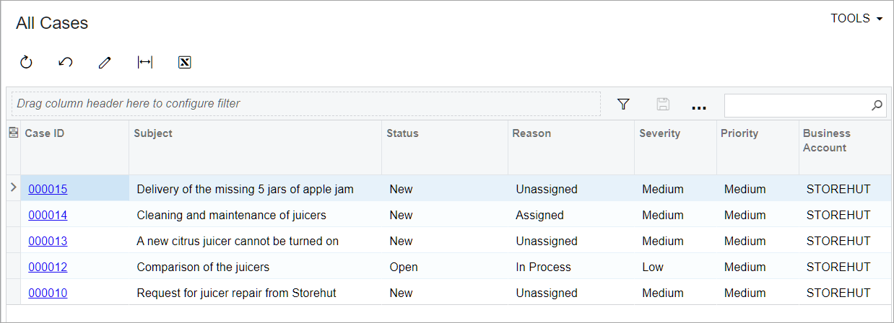

# Tailoring the Self-Service Portal: To Create a Generic Inquiry {#_184b1c12-0d96-4b16-ac3f-6a499d308135 .task}

In the following implementation activity, you will create a generic inquiry in the Acumatica Self-Service Portal.

## Story { .section}

Suppose that you are Kimberly Gibbs, system administrator who also handles generic inquiries at the SweetLife Fruits &amp; Jams company. You need to create a generic inquiry that will display the list of cases for the business account associated with the user. There is a predefined generic inquiry in Acumatica ERP that provides similar functionality. You need to copy it and adjust it for the Self-Service Portal users. This inquiry will be used in the future for building a dashboard.

## Configuration Overview { .section}

For the purposes of this activity, the following tasks have been performed:

-   The Acumatica ERP application instance with the *U100\_SSP\_Admin\_2026 R1* dataset preloaded and the Self-Service Portal application instance have been deployed in the same database.

    **Tip:** This deployment is outside of the scope of this training.

-   In the *U100\_SSP\_Admin\_2026 R1* dataset, on the [User Roles](SM_20_10_05.md) \(SM201005\) form of Acumatica ERP, the *Portal Admin* role has been assigned to the *gibbs* user account. The user account is associated with Kimberly Gibbs, the system administrator in the SweetLife Fruits &amp; Jams company. The role provides full administrative privileges in the Self-Service Portal.
-   On the [Business Accounts](CR_30_30_00.md) \(CR303000\) form, the *STOREHUT* business account has been created.
-   On the [Cases](CR_30_60_00.md) \(CR306000\) form, a few cases for the *STOREHUT* business account have been created.

## Process Overview { .section}

In this activity, you will do the following:

1.  Copy the *CR-Cases* inquiry on the [Generic Inquiry](SM_20_80_00.md) \(SM208000\) form
2.  Change the needed settings of the copied generic inquiry and publish it
3.  Verify that the customer user has access to the created generic inquiry
4.  Verify that the customer user can see the cases associated with the business account of the customer user

## System Preparation { .section}

Before you start creating a generic inquiry in the Self-Service Portal, do the following:

1.  Launch the Acumatica ERP instance with the *U100\_SSP\_Admin\_2026 R1* dataset preloaded.
2.  Sign in to the system as system administrator Kimberly Gibbs by using the *gibbs* username and the *123* password.
3.  On the [Enable/Disable Features](CS_10_00_00.md) \(CS100000\) form, make sure that the following features have been enabled:
    -   *Customer Portal*
    -   *B2B Ordering*
    -   *Case Management on Portal*
    -   *Financials on Portal*
4.  Make sure that you have performed the following prerequisite activities:
    1.  [Configuring the Self-Service Portal: To License the Self-Service Portal Instance](config_SSP_Admin_To_License_SSP_Instance.md)
    2.  [Configuring the Self-Service Portal: To Specify the General Settings of the Self-Service Portal](config_SSP_Admin_To_Specify_General_Settings_of_Instance.md)
    3.  [Managing Access to the Self-Service Portal: To Create User Roles for a Customer’s Employees](config_SSP_Admin_Managing_Access_to_SSP_Create_Roles_for_Customer_Employees.md)
    4.  [Managing Access to the Self-Service Portal: To Create User Types for User Accounts](config_SSP_Admin_Managing_Access_to_SSP_To_Create_User_Type_SSP.md)
    5.  [Managing Access to the Self-Service Portal: To Create User Accounts for Contacts](config_SSP_Admin_Access_to_SSP_Add_User_Account_for_Contact.md)
    6.  [Configuring Case Management in the Self-Service Portal: Implementation Activity](config_SSP_Admin_Configuring_Case_Management_in_SSP_Implem_Activity.md)
5.  Launch the Self-Service Portal website with the *U100\_SSP\_Admin\_2026 R1* dataset preloaded.
6.  Sign in to the system as system administrator Kimberly Gibbs by using the *gibbs* username and the *123* password.

## Step 1: Copying the Generic Inquiry { .section}

To copy the existing generic inquiry, do the following:

1.  In the Self-Service Portal, acting as system administrator Kimberly Gibbs, open the [Generic Inquiry](SM_20_80_00.md) \(SM208000\) form.
2.  In the **Inquiry Title** box of the Summary area, click the magnifier button and search for the *CR-Cases* inquiry.
3.  Double-click the record to select it.
4.  On the form toolbar, click the **Clipboard** button and then click **Copy**.
5.  On the form toolbar, click **Add New Record**.
6.  In the **Inquiry Title** box, type `PortalCases`.
7.  Press the Tab key or move the focus to any other box on the form.
8.  On the form toolbar, click **Clipboard** &gt; **Paste**. The system inserts and replaces the values on the tabs of the form.

    **Tip:** The system displays errors on the **Navigation** tab because the copied generic inquiry has a link to the form that does not exist in the Self-Service Portal. You will fix that in the next step.

9.  On the **Navigation** tab, in the **Navigation Targets** pane, do the following **for each row**:
    1.  In the **Link** column, click the row.
    2.  On the table toolbar, click **Delete Row**.
10. On the **Entry Point** tab, in the **Entry Screen** box \(the **Entry Screen Settings** section\), click the magnifier button, and double-click *Case Details* in the list of the available forms.
11. On the form toolbar, click **Save**.

You have created a new generic inquiry by copying a predefined inquiry that is available in Acumatica ERP. The created inquiry currently contains data about all cases existing in Acumatica ERP.

You need to restrict access to this information for the Self-Service Portal users so that they can see only those cases that are related to their business account \(*STOREHUT*\). In the next several steps, you will configure the inquiry to have the proper information in it.

## Step 2: Adding DACs to the Created Generic Inquiry { .section}

In this step, you will add new DACs to the inquiry. While you are still on the [Generic Inquiry](SM_20_80_00.md) \(SM208000\) form with the *PortalCases* inquiry selected, do the following:

1.  On the table toolbar of the **Data Sources** tab, click **Add Row**.
2.  In the **Source Name** column of the added row, select *PX.Objects.CR.Contact*.

    **Tip:** The list has about 600 DACs, so in the lookup table, you should use the Search box \(upper right\) to find the DAC.

3.  In the same row, in the **Alias** column, type `CustomerUser`.
4.  Add a new row.
5.  In the **Source Name** column of the added row, select *PX.Objects.CR.CRCaseClass*.
6.  In the same row, in the **Alias** column, type `CaseClass`.
7.  On the form toolbar, click **Save**.

## Step 3: Specifying Relations in the Generic Inquiry {#section_sxg_5b4_ypb .section}

Now you will specify the relations of the added DACs. While you are still on the [Generic Inquiry](SM_20_80_00.md) \(SM208000\) form with the *PortalCases* inquiry selected, on the table toolbar of the **Relations** tab, do the following:

1.  On the table toolbar of the **Table Relations** table, click **Add Row**.
2.  In the **Parent Table** column of the added row, select *CRCase*.
3.  In the **Child Table** column of the same row, select *CustomerUser*.
4.  In the same table, click **Add Row**.
5.  Specify the following settings for the added row:
    -   **Parent Table**: *CRCase*
    -   **Child Table**: *CaseClass*
6.  On the form toolbar, click **Save**.
7.  In the **Table Relations** table, click the row with *CustomerUser* in the **Child Table** column.
8.  On the table toolbar of the **Data Field Links For Active Relation** table \(which is below the **Table Relations** table\), click **Add Row**.
9.  In the **Parent Field** column of the added row, select *CustomerID*.
10. Leave the *Equals* value in the **Condition** column of the row.
11. In the **Child Field** column of the same row, select *BAccountID*.
12. On the form toolbar, click **Save**.
13. In the **Table Relations** table of the **Relations** tab, click the row with *CaseClass* in the **Child Table** column.
14. On the table toolbar of the **Data Field Links For Active Relation** table, click **Add Row**.
15. In the **Parent Field** column of the added row, select *CaseClassID*.
16. Leave the *Equals* value in the **Condition** column.
17. In the **Child Field** column of the same row, select *CaseClassID*.
18. On the form toolbar, click **Save**.

## Step 4: Adding Conditions to the Generic Inquiry {#section_gjt_rb4_ypb .section}

Now you need to add conditions that will filter the data. While you are still on the [Generic Inquiry](SM_20_80_00.md) \(SM208000\) form with the *PortalCases* inquiry selected, do the following:

1.  On the table toolbar of the **Conditions** tab, click **Add Row**.
2.  In the **Data Field** column of the added row, select *CustomerUser.UserID*.
3.  In the **Condition** column, leave the default *Equals* value.
4.  In the **From Schema** column, select the check box.
5.  In the **Value 1** column, type `@me`.
6.  On the table toolbar, click **Add Row**, and in the row, specify the following settings:
    1.  **Data Field**: *CaseClass.IsInternal*
    2.  **Condition**: *Does Not Equal*
    3.  **From Schema**: Selected
    4.  **Value 1**: Selected
7.  On the form toolbar, click **Save**.

## Step 5: Editing Navigation to the Case Details Form {#section_z42_2g4_ypb .section}

You can add navigation to a specific form by adding a link to the generic inquiry form. With this navigation in place, in the resulting inquiry form, a user can click any case ID and the system will open the Case Details \(SP203010\) form in a new tab with the details of the selected case.

While you are still on the [Generic Inquiry](SM_20_80_00.md) \(SM208000\) form with the *PortalCases* inquiry selected, do the following:

1.  Open the **Navigation** tab.
2.  On the **Navigation Targets** pane, for the row that has *SP203010 - Case Details* in the **Link** column, select *New Tab* in the **Window Mode** column.
3.  On the form toolbar, click **Save**.
4.  On the **Results Grid** tab, in the **Navigate To** column of the row with the *CaseCD* data field selected, select *SP203010 - Case Details*. This is the form the system will open if the user clicks a particular case ID in the resulting inquiry form.
5.  On the form toolbar, click **Save**.

## Step 6: Creating a Workspace { .section}

To create a workspace for new generic inquiry, do the following:

1.  In the Self-Service Portal, switch to Menu Editing mode as follows:
    1.  On the main menu panel \(in the lower left corner of the screen\), click the **Open Configuration Menu** \(\) button.
    2.  Click **Edit Menu**.
2.  On the top toolbar \(in the upper left corner of the screen\), click **Add Workspace**.
3.  In the **Workspace Parameters** dialog box, which opens, specify the following settings:

    1.  In the **Icon** box, select *inquiries*; this icon will be displayed in the title of the workspace.

        **Tip:** You can begin typing the name of the icon into the box to quickly find the icon.

    2.  In the **Area** box, select *Other*. This is the functional area for which the workspace will be displayed.
    3.  In the **Title** box, type `Other`.
    4.  Click **OK** to save your changes and close the dialog box.
    The empty **Other** workspace has been created. In Menu Editing mode, you can see the title of the newly created workspace on the main menu panel.

4.  In the upper right corner of the workspace title bar, click the **Pin to Main Menu Panel** \(\) button to add the new workspace to the main menu panel.

    **Important:** An empty workspace that does not have any links to the forms, reports, or dashboards, is not displayed on the main menu panel in view mode.

5.  In the lower left corner of the screen, click **Exit Menu Editing** to save your changes and stop working in Menu Editing mode.

## Step 7: Making the Generic Inquiry Visible for Self-Service Portal Users {#section_vyc_5d4_ypb .section}

Now that you have changed the needed settings of the inquiry, you will make it visible for Self-Service Portal users. Do the following:

1.  On [Generic Inquiry](SM_20_80_00.md) \(SM208000\) form, open the *PortalCases* inquiry you have created in the activity.
2.  On the form toolbar of the [Generic Inquiry](SM_20_80_00.md) \(SM208000\) form, click the **Publish to the UI** button. The **Publish to the UI** dialog box opens.
3.  In the dialog box, specify the following settings:
    1.  **Site Map Title**: `All Cases`
    2.  **Workspace**: *Other*
    3.  **Category**: *Inquiries*
4.  In the **Access Rights** section of the dialog box, select the **Set to Granted for all Roles** option button. You might need to specify the roles needed to access this inquiry.
5.  Click **Publish** to complete the publication process.
6.  Sign out of the Self-Service Portal.

## Step 8: Verifying a Customer User's Access to the Generic Inquiry Form {#section_iss_hf4_ypb .section}

In this step, you will verify that customer users have access to the inquiry by signing in to Ray Newman's user account. Do the following.

1.  Sign in to the Self-Service Portal as Ray Newman by using the *ray.newman@storehut.example.com* username and the *123* password.
2.  On the main menu panel, click **Other** to open the workspace.
3.  Under the **Inquiries** category, click *All Cases* to open the generic inquiry form.
4.  Verify that you can see the list of the cases related to the *Storehut* business account only, as shown in the following screenshot.

    

5.  In the row with *Comparison of the juicers* in the **Subject** column, click the link in the **Case ID** column. Make sure that the case opens on the Case Details \(SP203010\) form in a new browser tab.

**Parent topic:**[Tailoring the Self-Service Portal](../UserGuide/config_SSP_Admin_Tailoring_SSP_Mapref.md)

