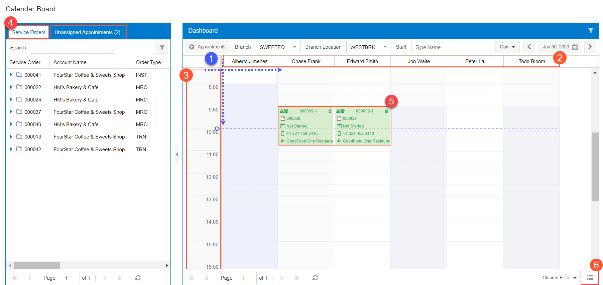
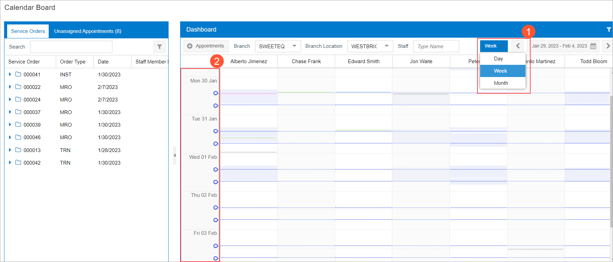
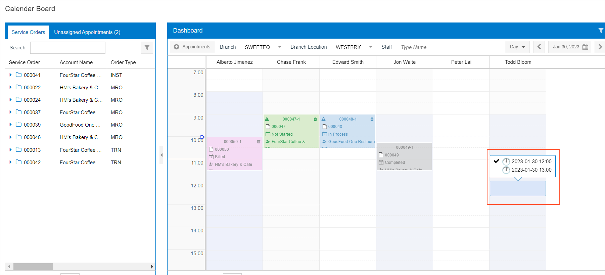
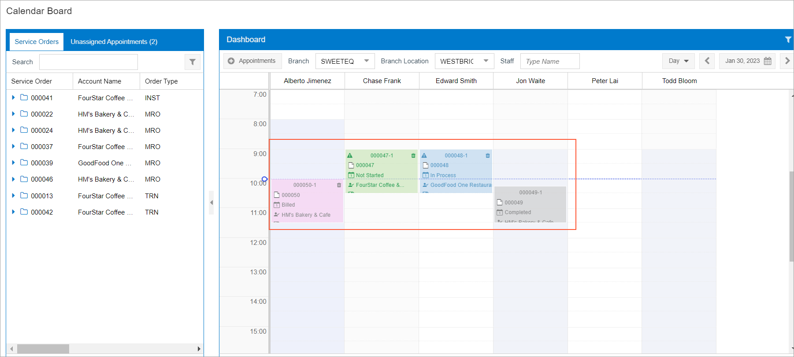
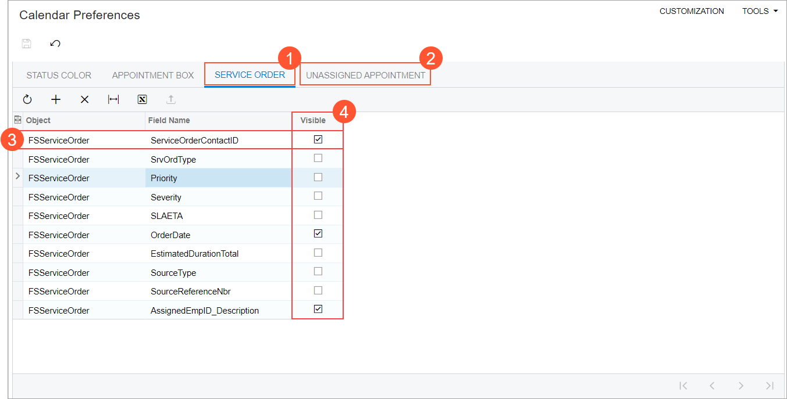

# Calendar Board Configuration Options {#_a68da94f-4823-49fa-b603-49dc5b062963 .concept}

**Important:**

This topic describes the calendar board available in the Classic UI of Acumatica ERP.

For information about the Modern UI calendar board, see [Scheduling Appointments: Calendar Board](FieldService_Scheduling_with_Modern_Calendar_Board_concept.md). The following boards are no longer available in the Modern UI:

-   *Staff Calendar Board \(FS300400\)* form
-   *Room Calendar Board \(FS300700\)* form
-   *Staff Working Schedule Board \(FS300500\) form*
-   *Dispatch Board \(FS301300\)* form \(available with customization only\)
-   *Staff Appointments on Map \(FS301100\)* form
-   *Appointment History on Map \(FS301200\)* form

The calendar board forms—that is, [Calendar Board](FS_30_03_00.md) \(FS300300\), [Staff Calendar Board](FS_30_04_00.md) \(FS300400\), and [Room Calendar Board](FS_30_07_00.md) \(FS300700 \)—have similar layouts. These calendar boards consist of the pane with the **Service Orders** and **Unassigned Appointments** tabs, which is on the left side of the form, and the **Dashboard** pane, which is on the right side and provides a visual representation of the appointments.

This topic describes the configuration options for the following parts or entities of the calendar board forms:

-   The horizontal axis and the vertical axis of the calendar dashboard \(see Item 1 in the following screenshot, which shows the [Calendar Board](FS_30_03_00.md) form\)
-   The number of staff members that can be displayed simultaneously on the calendar board \(Item 2\)
-   The time range on the time axis \(Item 3\)
-   The pane with the **Service Orders** and **Unassigned Appointments** tabs \(Item 4\)
-   The appointment boxes representing scheduled appointments \(Item 5\)
-   The view mode button \(Item 6\)

Users can change configuration options while they are working on a calendar board form. Also, default configuration options can be specified at the system level.

## Modifying the Calendar Board View Mode { .section}

The view mode \(that is, the orientation of the information\) can be changed on the [Calendar Board](FS_30_03_00.md) \(FS300300\) and [Room Calendar Board](FS_30_07_00.md) \(FS300700\) forms.

The default view mode can be modified, so that the calendar board will initially be displayed in this mode any time you open it. On the [Service Management Preferences](FS_10_01_00.md) \(FS100100\) form, on the **Calendars &amp; Maps** tab \(**Default Calendar Settings** section\), an administrative user selects *Vertical* or *Horizontal* in the **View Mode** box. With the *Vertical* mode, staff members \(on the [Calendar Board](FS_30_03_00.md) form\) or rooms \(on the [Room Calendar Board](FS_30_07_00.md) form\) are shown on the horizontal axis of the board, and times are shown on the vertical axis. In *Horizontal* mode, the axes are reversed.

You can modify the calendar board orientation view on-the-fly by clicking the orientation mode button \(Item 6 in the screenshot above\) so that the default orientation view will be changed while you are working with the calendar board.

## Modifying the Number of Staff Members Shown { .section}

The maximum number of staff members that may be shown on a calendar's vertical or horizontal axis can be modified. To do this, on the [Service Management Preferences](FS_10_01_00.md) form, on the **Calendars &amp; Maps** tab \(**Calendar Settings** section\), in the **Number of Staff Members** box, an administrative user specifies the maximum number of staff members to be displayed on the calendar.

By default, *10* is specified in the box. If the box is cleared and saved, all staff members available in the system will be shown on the calendar board.

**Attention:** If a large number of staff members are displayed, this can lead to system performance issues.

## Changing the Default Time Range { .section}

You can modify the time range on the time axis while you are working on any calendar board by selecting *Day*, *Week*, or *Month* in the drop-down menu on the dashboard toolbar \(Item 1 in the following screenshot\). This affects only your view of the calendar board during this user session.

Also, an administrative user can change the default time range setting, which is applied each time you opens a calendar board. To change the default time range setting, on the **Calendars &amp; Maps** tab of the [Service Management Preferences](FS_10_01_00.md) \(FS100100\) form, in the **Time Range** box of the **Default Calendar Settings** section, an administrative user selects *Day*, *Week*, or *Month*. The specified time range is initially used for all users when they open the calendar board form. The following screenshot shows the view if the *Week* option is specified \(Item 2\).

## Adjusting the Precision of Appointments' Duration { .section}

The precision, which is applied to the duration of each appointment being created on the calendar boards, can be adjusted. The precision defines the minimum interval in minutes in which the duration of appointments can be specified. For example, if the precision is set to 30 minutes, then the minimum duration of a created appointment can be 30 minutes, and can be increased by only 30-minute intervals \(for example, to 60 minutes or 90 minutes\). An administrative user specifies this setting on the [Service Management Preferences](FS_10_01_00.md) \(FS100100\) form. On the **Calendars &amp; Maps** tab of this form, one of the following options can be selected in the **Appointment Resize Precision** box:

-   *10 minutes*
-   *15 minutes*
-   *30 minutes*
-   *60 minutes*

The selected precision is applicable to all three calendar boards for all users. \(That is, it cannot be overridden by an individual user viewing a calendar board.\)

The following screenshot shows the creation of an appointment with a precision of 60 minutes. A user created this appointment by clicking the staff member column area and dragging the shaded area downward \(from 12:00 to 13:00\).

## Changing the Color and Content of the Appointment Boxes { .section}

The color of the appointment boxes that are displayed on the calendar and the text inside these boxes can be customized. An administrative user can specify any color for the background of appointment boxes and for the text in the box with a particular appointment status. They can also specify which information is displayed in the appointment boxes.

The colors of appointment boxes and of the text inside the boxes are specified on the **Status Color** tab of the [Calendar Preferences](FS_10_05_00.md) \(FS100500\) form. On this form, in the table, all possible appointment statuses are listed along with their colors and the **Visible** check box, which you can select or clear to make appointment boxes of the status visible or hidden, respectively..

To select a color for appointment boxes with a particular appointment status, an administrative user first selects the row that represents the needed status. Then in the **Selected Status** section of the tab, a user selects the color for the background and for the text in an box. The administrative user selects a color in the palette dialog window, which is opened when they click within the **Background Color** box or the **Text Color** box.

The following screenshot shows appointment boxes that have different colors based on the status of the appointment.

On the **Appointment Box** tab of the [Calendar Preferences](FS_10_05_00.md) form, an administrative user also can specify what field values will be displayed in appointment boxes.

**Tip:** The appointment number is always shown at the top of the appointment box. It does not have a corresponding row in the table on the **Appointment Box** tab

The table on this tab contains a list of the fields whose values can be displayed in each appointment box. The field values might include the customer, the appointment's status, and the reference number of the related service order. You can add or delete rows, and you can move the rows up and down to change the order in which the field values are displayed in an appointment box. In each row, you can specify the object and field whose value will be shown, as well as the icon to be shown for it. For each row, you can also specify whether the field value is visible in an appointment box by selecting or clearing the **Visible** check box.

## Managing Columns on the Service Orders and Unassigned Appointments Tabs { .section}

The number and order of columns displayed on the **Service Orders** tab and **Unassigned Appointments** tab of the calendar board forms can be modified.

On the **Service Order** tab \(see Item 1 in the following screenshot\) of the [Calendar Preferences](FS_10_05_00.md) \(FS100500\) form, each row \(Item 3\) of the table represents a column that can be shown on the **Service Orders** tab of calendar board forms. An administrative user can specify the columns that can be displayed and manage the visibility of each column by selecting or clearing the **Visible** check box \(Item 4\) in the row. They can also modify the order in which the columns will be displayed by moving rows up or down in the table.

The columns of the **Unassigned Appointments** tab of calendar forms can be managed in the same ways by using the **Unassigned Appointment** tab \(Item 2\) of the [Calendar Preferences](FS_10_05_00.md) form.

**Attention:** Displaying a large number of columns can lead to system performance issues.

**Parent topic:**[Working with the Calendar Board](../UserGuide/config_ServMgmt_Calendar_Mapref.md)

