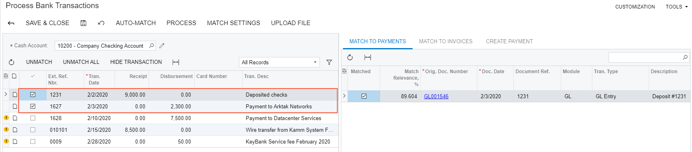
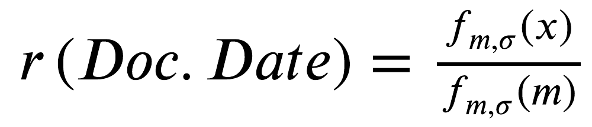
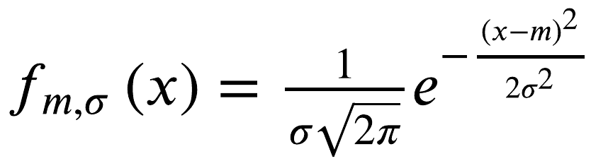
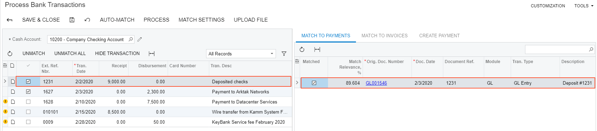
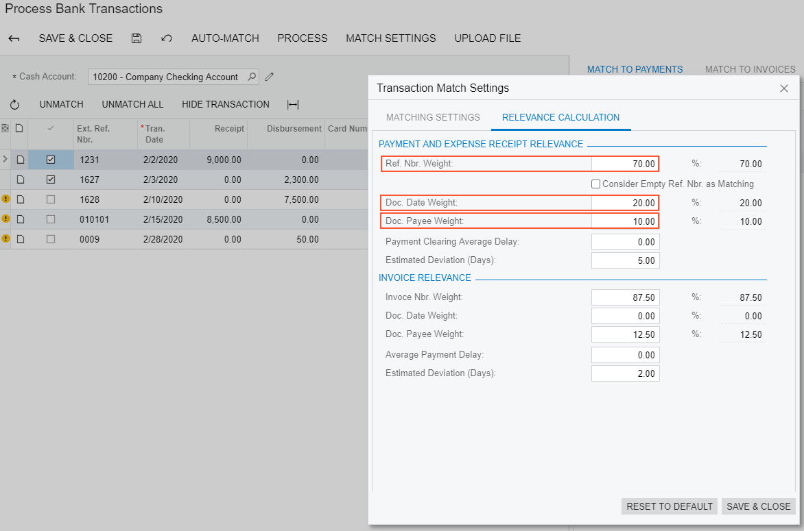
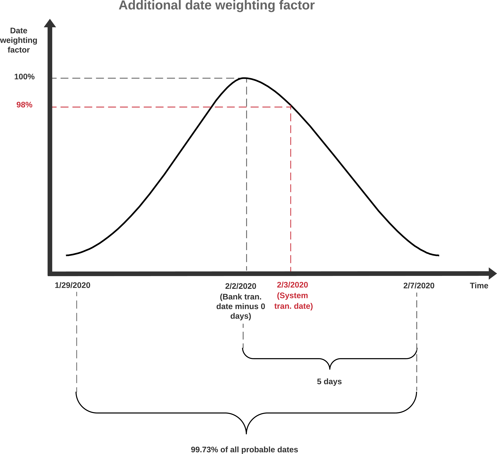

# Bank Reconciliation: Additional Information {#_6c1bc42b-e82d-4bf4-b8f2-6df25cbf6b2f .concept}

This topic provides additional information about and examples of the comparison of transactions by particular factors and the calculation of matching relevance. This information is provided for reference and is not required reading.

## Comparison Example {#section_qm2_kjv_vxb .section}

For example, suppose that when you are processing bank transactions uploaded from a bank statement for February 2020, the [Process Bank Transactions](CA_30_60_00.md) \(CA306000\) form shows two transactions that have been automatically matched to the cash account transactions in the system \(see the following screenshot\). The remainder of the section describes how the match candidates have been found and how the best candidate has been selected for each of the transactions.

**Note:** This topic describes the match relevance calculation only for the **Match to Payments** tab \(in the right pane of the [Process Bank Transactions](CA_30_60_00.md) form\).



There can be multiple transactions that could match a single transaction from the bank statement. The system searches for possible candidates, which are payments \(shown later in this example\) and invoices for which payments are expected, by considering whether they meet the following conditions:

-   The transaction amount in the system is equal to the transaction amount in the bank statement.
-   The payment date falls within the range specified in the **Days Before Bank Transaction Date** and **Days After Bank Transaction Date** boxes on the **Matching Settings** tab of the **Transaction Matching Settings** dialog box.
-   The sign of the amount \(that is, whether the transaction is a receipt or disbursement in the cash account\) is the same as the sign of the amount in the bank statement.

Each transaction that meets all these conditions appears on the **Match to Payments** tab.

**Note:** If the **Allow Matching to Credit Memo** check box is selected on the **Bank Statements** tab of the [Cash Management Preferences](CA_10_10_00.md) \(CA101000\) form, the system will automatically match disbursement bank transactions to credit memos by the reference number prior to matching them to AP bills.

**Tip:** You can modify the matching settings that apply to the current matching process and experiment with them to find the best values for the relevance calculation in your case. After that, you can specify the resulting values as the default ones on the **Bank Statements** tab of the [Cash Management Preferences](CA_10_10_00.md) form.

## Match Relevance Calculation {#section_ndq_sv5_yq .section}

The match relevance percent, shown in the **Match Relevance, %** column of the **Match to Payments** tab of the [Process Bank Transactions](CA_30_60_00.md) \(CA306000\) form, shows how likely it is that the transaction in the system corresponds to the transaction in the bank statement. The match relevance ranges between 0% and 100%, and the best match is the transaction with the highest \(or a significantly high\) match relevance percent.

The match relevance is calculated based on the matching settings, which are specified in the **Transaction Matching Settings** dialog box \(**Relevance Calculation** tab\) of the [Process Bank Transactions](CA_30_60_00.md) form. On this tab, in the **Payment and Expense Receipt Relevance** section, you specify the relative weight of the three factors used to calculate the likelihood:

-   Reference number \(in the **Ref. Nbr. Weight** box\)
-   Date of the document \(in the **Doc. Date Weight** box\)
-   Payee information \(in the **Doc. Payee Weight** box\)

For each of these factors, you specify the percent or weight of the factor the system should use when it calculates the match relevance. Before calculating the match relevance, the system applies to the document date factor an additional weighting by the number of days the transaction in the bank statement usually appears after it has been processed in the system. Also, if the **Consider Empty Ref. Nbr. as Matching** check box is selected, the system matches bank transactions with empty reference numbers to cash transactions with empty reference numbers.

The additional weighting settings for the date are the following:

-   **Payment Clearing Average Delay**: Here you specify the number of days the payment is usually delayed \(compared to the document date in the system\) before it appears in the bank statement.
-   **Estimated Deviation \(Days\)**: Here you specify the number of days before and after the average delay date, which includes almost all of the possible dates of the transactions in the system that could match the transaction in the bank statement. A date that is outside of the date range with the specified number of days is unlikely to be the date of the bank transaction.

The match relevance calculation formula of a candidate transaction, which is indicated as R below, is the following.

``` {#codeblock_cn2_kjv_vxb}
R = W1*(Ref.Nbr?) + W2*r(Doc.Date) + W3*(Doc.Payee?)
```

where:

-   *R*: The match relevance rate of a candidate transaction
-   *Wi*: Factor weights
-   *r\(Doc.Date\)*: Additional weighting function, calculated as follows:  where 
-   *x*: The number of days the bank statement transaction is later than expected
-   *m*: Payment clearing average delay in days
-   : Estimated deviation in days

For the first bank transaction in the following screenshot, with external reference number *1231* \($9000 deposit\), a possible match has been found based on the reference number and transaction date.



When calculating the relevance percent, the system has used the settings specified in the **Transaction Match Settings** dialog box \(see the screenshot\).



The reference number of the possible match in the system is the same as the reference number of the bank transaction. The date of the possible match in the system is *2/3/2020*, which falls within the date range of 99.73% probable dates of the bank transaction. The probable date range is 1/29/2020 through 2/7/2020, as shown in the diagram below. The bank transaction date is one day before the transaction date in the system. Because the date is shifted, the additional weighting function for the date is equal to 0.98, which is the normalized value of the Gaussian distribution with the mean of 0 \(**Payment Clearing Average Delay**\) and the standard deviation of 5 \(**Estimated Deviation \(Days\)**\). As the result, the match relevance rate for the transaction is 70 \* 1 + 20 \* 0.98 + 10 \* 0 = 89.604, where the factors are the reference number, document date, and payee, respectively. The calculation of the additional date weighting factor is illustrated in the diagram below.



The two automatically matched transactions have a high relevance by which the system has recognized them as the best candidates:

-   The transaction with reference number *1231* has a relevance of 89.604.
-   The transaction with reference number *1627* has a relevance of 90.769.

To have the largest number of transactions matched automatically, you can adjust the weights of the match relevance factors by which the system calculates the match relevance.

## Rules for Selecting the Best Match {#section_lcz_sv5_yq .section}

On the **Match to Payments** tab of the [Process Bank Transactions](CA_30_60_00.md) \(CA306000\) form, based on the calculated match relevance, the system selects the best match according to the following rules:

1.  The best match is the transaction with the highest match relevance rate if it is greater than the **Absolute Matching Threshold** value, which is `75` by default and can be overridden.
2.  If no transactions have a match relevance rate that is 75 or greater, the best match is the transaction with the highest match relevance and the difference between its match relevance and the match relevance of any other document is higher than the **Relative Matching Threshold** value, which is 20 by default and can be overridden. For example, if two transactions were found, one with a relevance of 25 and the other with a relevance of 50, the transaction with the relevance 50 would be matched.
3.  If only one transaction is found, the transaction is the best match if its match relevance is higher than the value of the **Relative Matching Threshold**.
4.  If no previous rule has been applied, there is no best match for the transaction in the bank statement.

**Note:** If you want to change the matching settings and run the auto-matching process again, you need to clear the results of the previous auto-matching. To do this, on the [Process Bank Transactions](CA_30_60_00.md) \(CA306000\) form, click **Unmatch All** on the table toolbar, and then click **Auto-Match** on the form toolbar to rerun the process of auto-matching.

**Parent topic:**[Performing Bank Reconciliation](../UserGuide/Finance_Bank_Reconciliation_Mapref.md)

