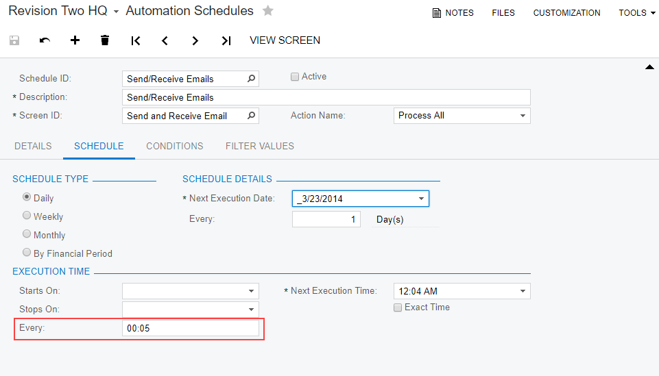
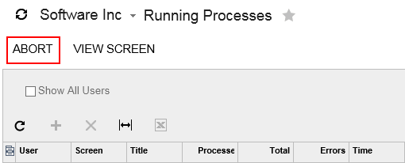

# Step 1: Check the Most Basic Causes {#_41baf63f-8e14-4048-aa3d-49c9cdc601ce .task}

To exclude the reasons that lead to performance slowdown most frequently, you should perform the substeps described in the sections that follow.

## 1. Check Whether the Site Is Licensed {#_36238980-f793-4d0d-8b88-4cbcb9b6077b .section}

The slowdown may be caused by the site not being licensed. Sites in trial mode allow only two concurrent users and limit the usage of hardware resources.

If you have already registered the site, it could become unlicensed for the following reasons:

-   A user may be using a URL of an unregistered site—for example, if the user is accessing the site through a bookmark with that URL.
-   Some hardware changes have been made to the application server—for example, more CPUs have been added, or the application pools have been changed.

Perform the following task to check whether the site is licensed.

**To check whether the site is licensed:**

1.  Check if the site is licensed in one of the following ways:
    -   Make sure there is no message in the bottom of the browser window that says *Your product is in the trial mode. Only two concurrent users are allowed. Activate*. See the message in the following screenshot.
    -   On the [Activate License](SM_20_15_10.md) \(SM201510\) form, check the value of the **Status** element. An unregistered site has the *Invalid* status.
2.  Depending on the results of the previous instruction, do one of the following:
    -   If the site is not licensed, activate the license by following the instructions in [Instance Deployment: To Enable Features and Activate the License](INST_Deploying_Instances_Enabling_Features_Activity.md).
    -   If the site is licensed, continue with the next substep.

## 2. Check the Speed from Other Browsers {#_cacf2a39-2ffa-4729-af83-da68d6845964 .section}

Another possible reason for the slowdown is that some properties of the browser may be preventing the site from running faster.

Perform the following task to see whether this is the reason for the slowdown.

**To check the speed from other browsers:**

1.  Try to access the site from another browser.
2.  Depending on the results of the previous instruction, do one of the following:
    -   If the issue is reproduced in only one browser, check the version of the browser, and try to reproduce the issue in the latest version of the browser. You can also try to turn off plug-ins in the browser. Collect more information on the slowdown, and send it to the Acumatica support team, as described in [Step 5: Collect More Information](how_Troubleshoot_Performance_Step5.md#) and [Step 6: Submit a Case to Acumatica Support](how_Troubleshoot_Performance_Step6.md#).
    -   If the issue is reproduced in all browsers, continue with the next substep.

## 3. Check the Speed from Other Locations {#_e8fa44f8-311c-4d2a-a2e2-aabed4a155d5 .section}

Some network or internet service provider issues at the user’s end may be causing a performance slowdown.

Perform the following task to see whether this is the reason for the slowdown.

**To check the speed from other locations:**

1.  Try to reproduce the slowdown issue on some computers at a different location.
2.  Depending on the results of the previous instruction, do one of the following:
    -   If the issue is not reproduced on other computers, the problem is probably in the client’s network. Ask the client to check the network settings.
    -   If the issue is reproduced on multiple computers, continue with the next substep.

## 4. Check Automation Schedules {#_3f2ef842-3b6a-4c79-9be7-99cbb953f227 .section}

Slowdowns may be caused by errors on active schedules, unprocessed emails, or insufficient time for a scheduled processes to complete before others begin.

Perform the following tasks to check the automation schedules.

**To look for errors on the active schedules:**

1.  On the [Automation Schedule Statuses](SM_20_50_30.md) \(SM205030\) form, look for errors on the active schedules. \(For each schedule, see the **Status** and the **Last Execution Result** columns.\)
2.  Depending on the results of the previous instruction, do one of the following:
    -   If you found an error, either correct the error in the scheduled process or deactivate the schedule.
    -   If there are no errors in automation schedules, continue with the next task.

**To check the frequency of schedules:**

1.  On the [Automation Schedule Statuses](SM_20_50_30.md) form, make sure there are no schedules starting at the same time or within short intervals.
2.  Depending on the results of the previous instruction, do one of the following:
    -   If you have found some overlap in the schedules, correct the execution times of any needed schedules. For example, we recommend that you leave at least 5 minutes between executions of the *Send and Receive Email*schedule, as shown in the following screenshot.

        

    -   If there is enough time for each process to finish before the start of the next scheduled process, continue with the next task.

**To look for failed and old unprocessed emails:**

1.  On the [All Emails](CO_40_90_70.md) \(CO409070\) form, look for failed and old unprocessed emails.
2.  Depending on the results of the previous instruction, do one of the following:
    -   If you have found failed or old unprocessed emails, delete them.
    -   If there are no failed or unprocessed emails, continue with the next substep.

## **5. Explore the Running Processes** {#_ba43ed97-9782-4aea-9b48-820b14cfb5fe .section}

The slowdown could be caused by some process that is hung and is running in an endless loop.

Perform the following tasks to check the running processes.

**To Check the Running Processes in Acumatica ERP**

On the [System Monitor](SM_20_15_30.md) \(SM201530\) form, check the list of all ongoing processes for all users as follows:

1.  Look for processes that have been going on for a long time \(typically you should look for processes running longer than 30 minutes\) to see if the process is hung and running in an endless loop.
2.  Depending on the results of the previous instruction, do the following:
    -   If some process is hung, select the process and click **Abort** on the form toolbar to end the process, as shown in the following screenshot. If the situation repeats, collect more information on the slowdown and send it to the Acumatica support team, as described in [Step 5: Collect More Information](how_Troubleshoot_Performance_Step5.md#) and [Step 6: Submit a Case to Acumatica Support](how_Troubleshoot_Performance_Step6.md#).

        

    -   If no process is hung, continue with the next task.

**To check the running processes in the operating system:**

1.  In Task Manager, review the running processes as follows:
    -   Check the memory consumption of the *w3wp.exe* process.

        **Note:** Acumatica ERP runs under the *w3wp.exe* process, with the username that is the name of the application pool.

    -   Check whether other processes are executed at the same time and review their memory consumption.
2.  Depending on the results of the previous, do one of the following:
    -   If *w3wp.exe* is using almost all memory, create a process dump, as described in [If your site is completely non-responsive or extremely slow](how_Troubleshoot_Performance_Step5.md#_2505615e-ba3f-4ee6-ac6d-fb0222d14d5c) in Step 5. Try to restart the process.
    -   If another process takes too much time, either investigate the reasons or end the process.
    -   If memory consumption of the *w3wp.exe* is normal and no other processes are taking too much time or using too much server memory, continue with the next substep.

## **6. Check Whether Antivirus Software Is Blocking Some Functionality of the Site** {#_8d5338a1-c780-4797-8728-a786fbf92abb .section}

Some settings of antivirus software could be preventing the site from working normally.

Perform the following task to see whether antivirus software is the reason for the slowdown.

**To check whether the antivirus software is blocking the site:**

1.  Check the antivirus logs, and try to turn off the antivirus software, if any.
2.  Depending on the results of the previous instruction, do one of the following:
    -   If the antivirus software is blocking the site, change the antivirus settings.
    -   If the antivirus software is not blocking the site, continue with [Step 2: Investigate Application Server Time and Database Server Time in the Request Profiler](how_Troubleshoot_Performance_Step2.md#).

**Parent topic:**[Troubleshooting Performance](../UserGuide/how_Troubleshoot_Performance.md)

