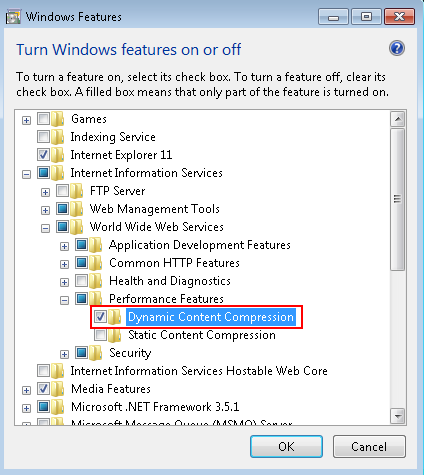

# Step 3: Check the Configuration of the Application Server {#_3476d2eb-0feb-404c-9a3a-51996bd11162 .task}

Several settings of the application server may be configured incorrectly, leading to the performance slowdown.

If correction of the application server settings does not improve the performance, collect more information on the slowdown and send it to the Acumatica support team, as described in [Step 5: Collect More Information](how_Troubleshoot_Performance_Step5.md#) and [Step 6: Submit a Case to Acumatica Support](how_Troubleshoot_Performance_Step6.md#).

Perform the following tasks to check the configuration of the application server.

**To enable dynamic compression:**

You should enable dynamic content compression, which is disabled by default. The HTTP compression setting on Internet Information Services \(IIS\) can provide faster transmission times between IIS and the client browser.

Click **Start** &gt; **Control Panel** &gt; **Programs** &gt; **Turn Windows features on or off**. In the **Windows Features** dialog box, which opens, select the **Dynamic Content Compression** check box \(**Internet Information Services** &gt; **World Wide Web Services** &gt; **Performance Features**\), which is shown in the following screenshot.

**To use a dedicated application pool:**

All Acumatica ERP instances should use their own application pools, which are not shared with any other applications.

When you are creating a new instance in Acumatica ERP Configuration wizard, you should always use the **Create New Application Pool** setting.

You can change the application pool of an already-configured application in Internet Information Services \(IIS\) Manager as described in [https://technet.microsoft.com/en-us/library/cc731755\(v=ws.10\).aspx](https://technet.microsoft.com/en-us/library/cc731755(v=ws.10).aspx).

**To check the IIS configuration on a 64-bit server:**

You should make sure the application pool does not enable 32-bit applications on a 64-bit application server, which can slow down the performance of a 64-bit server.

In the **Connections** pane of Internet Information Services \(IIS\) Manager, click **Application Pools**. Right-click the needed application pool, and in the pop-up menu, click **Advanced Settings**. Make sure the **Enable 32-Bit Applications** setting in the **General** group is set to *False*.

**Parent topic:**[Troubleshooting Performance](../UserGuide/how_Troubleshoot_Performance.md)

