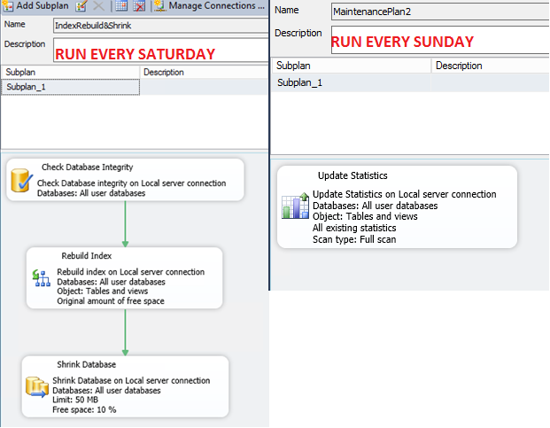

# Step 4.1: Check the Configuration of Microsoft SQL Server and Run Reports {#_b8223b9f-40a3-441e-9562-5ec3db5f14b3 .task}

To make sure that Microsoft SQL Server works correctly, you should perform the substeps described below.

## 1. Check the Configuration of the Database Server {#_0a4969cd-273f-48b6-8db0-a806663603b3 .section}

Settings of Microsoft SQL Server may not be configured properly, leading to the performance slowdown.

If correction of Microsoft SQL Server settings does not improve the performance of the site, continue with [2. Run Performance Reports](#_370d83b1-6a5c-415a-b461-20adae300041).

Perform the following tasks to check Microsoft SQL Server configuration.

**To ensure that Microsoft SQL Server is not restricted on memory usage:**

In Microsoft SQL Server Management Studio, right-click the database server instance and select **Properties**. In the **Server Properties** dialog box, click **Memory**. Set the value in the **Maximum server memory \(in MB\)** box to 75 to 80 percent of the total physical memory of the server, but leave at least 4 GB available for the operating system. For example, if your server has a total memory of 16 GB, you can set the maximum server memory to 12 GB \(which is 75 percent but leaves 4 GB for the operating system\).

**To schedule the weekly maintenance plan:**

By using the **Maintenance Wizard** in Microsoft SQL Server Management Studio, schedule the following tasks:

-   **Database Integrity Check**: Checks the logical and physical integrity of the database
-   **Rebuild Index**: Helps remove gaps in data pages and eases the data retrieval process
-   **Shrink Database**: Removes space by moving pages from the end of the file to the front, and then deallocates the excess space back to the file system
-   **Update Statistics**: Internally updates statistical information about tables and indexes used by SQL Query Optimizer during data retrieval requests

You can find more information on creating maintenance plans in [https://msdn.microsoft.com/en-us/library/ms189953.aspx](https://msdn.microsoft.com/en-us/library/ms189953.aspx).

See an example of the schedule of the recommended maintenance plans in the following screenshot.



## 2. Run Performance Reports {#_370d83b1-6a5c-415a-b461-20adae300041 .section}

Some SQL queries consume too many resources.

To find out the top resource-consuming SQL queries, you should perform either or both of the following tasks. You should collect data on the resource-consuming SQL queries as quickly as possible after a performance slowdown occurs, because information in such reports is updated frequently during the process of server work.

**To find out the top resource-consuming SQL queries by using a standard report:**

1.  In the **Object Explorer** of Microsoft SQL Server Management Studio, right-click the server instance, and select **Reports** &gt; **Standard Reports** &gt; **Performance - Top Queries by Average CPU Time**. Microsoft SQL Server Management Studio opens the report.
2.  Right-click the report, select **Export**, and select the format of the exported report.
3.  Send this report, along with other information on the slowdown, to the Acumatica support team. \(See the list of information that you should provide to support in [Step 6: Submit a Case to Acumatica Support](how_Troubleshoot_Performance_Step6.md#).\)

**To find out the top resource-consuming SQL queries manually:**

1.  Perform the following SQL query to get the performance report. By using this report, you get the same information that is provided in the standard report but in a table format, which can be more convenient. Moreover, as a result of this request, you get not only average CPU time \(`AvgCPU`\) but also the number of times the process was executed \(`execution_count`\). Therefore, you can find out not only which process is taking the longest but also which process is being executed the most.

    ```
    SELECT  top 100
    total_worker_time AS TotalCPU
    , total_elapsed_time/execution_count AS AvgDuration  
    , total_elapsed_time AS TotalDuration  
    , (total_logical_reads+total_physical_reads)/execution_count AS AvgReads 
    , (total_logical_reads+total_physical_reads) AS TotalReads
    , execution_count  
    , SUBSTRING      
            (st.TEXT, (qs.statement_start_offset/2)+1,
                  (
                  (CASE qs.statement_end_offset
                         WHEN -1       THEN datalength(st.TEXT)
                         ELSE qs.statement_end_offset
                         END - qs.statement_start_offset)/2)+ 1
            )AS txt  
    , convert(nvarchar(max),query_plan)
    , CONVERT(int, depa.value) 
    
    FROM [master].[sys].[dm_exec_query_stats] AS qs  WITH (NOLOCK)
    cross apply [master].[sys].[dm_exec_sql_text](qs.sql_handle) AS st  
    cross apply [master].[sys].[dm_exec_query_plan] (qs.plan_handle) AS qp 
    cross apply [master].[sys].[dm_exec_plan_attributes](qs.plan_handle) depa  
    WHERE (depa.attribute = 'dbid')
    ORDER BY 1 DESC;
    ```

2.  Send the results of the query, along with other information on the slowdown, to the Acumatica support team. \(For the list of information that you should provide to support, see [Step 6: Submit a Case to Acumatica Support](how_Troubleshoot_Performance_Step6.md#).\)

## 3. Check the SQL Activity Monitor for Locks {#_f0ec98d2-edc3-4c3e-928f-234b3860aae5 .section}

1.  In the Object Explorer of Microsoft SQL Server Management Studio, right-click the instance name, and then select **Activity Monitor**.
2.  Review the **Recent Expensive Queries** section.
3.  Send the data from the SQL Activity Monitor, along with other information on the slowdown, to the Acumatica support team. \(For the list of information that you should provide to support, see [Step 6: Submit a Case to Acumatica Support](how_Troubleshoot_Performance_Step6.md#).\)

**Parent topic:**[Troubleshooting Performance](../UserGuide/how_Troubleshoot_Performance.md)

