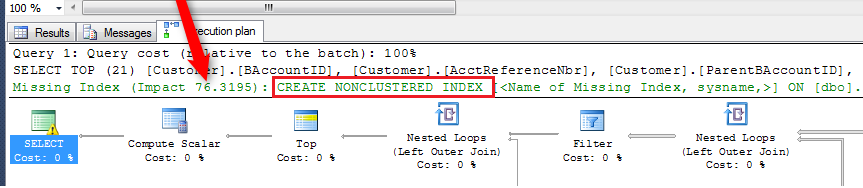
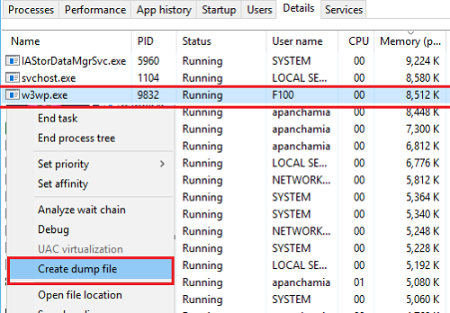
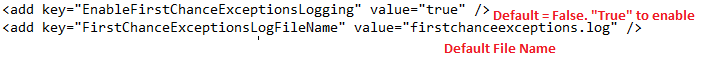

# Step 5: Collect More Information {#_d2927170-7019-419e-8385-36a7d34e4652 .task}

If you have not found the reason for the performance slowdown while performing the previous steps or you need to collect more details about it, perform the following substeps.

## 1. Investigate Requests in the Request Profiler {#_2eccbfeb-aafd-4ac5-a947-f551b22077e4 .section}

Do the following to isolate queries leading to errors and performance lags:

1.  Open an Acumatica ERP form.
2.  Click **Settings** &gt; **Profiler** on the form title bar, and click **Start Logging** in the **Profiler** dialog box, which opens. The [Request Profiler](../Shared/../UserGuide/SM_20_50_70.md) starts logging URL requests, SQL queries, exceptions, and warnings and errors.
3.  Reproduce the slowdown in the system.
4.  Click **Settings** &gt; **Profiler** on the form title bar, and click **Stop and Export** in the **Profiler** dialog box. The [Request Profiler](../Shared/../UserGuide/SM_20_50_70.md) returns to the default monitoring and exports a ZIP archive with the log files that contain information in JSON format about the performed URL requests, SQL requests, and stack trace.
5.  On the [Request Profiler](SM_20_50_70.md) \(SM205070\) form, click **Refresh Results**on the form toolbar to upload to the form all the new activities since the last refresh.
6.  Review the list of requests on the **Requests** tab as follows:
    -   Find requests that have a value other than *LongRun* in the **Request Type** column with a server time greater than 2000 milliseconds.
    -   Find requests that have a value more than 1000 in the **SQL Count** column.
7.  For each request that meets either or both of the criteria above, select the corresponding row in the table, and click **View SQL** on the table toolbar to see the queries being executed.
8.  In the **View SQL** dialog box, which opens, review the **SQL Time, ms** column, which shows the time taken by each step, and find the row with the biggest value in this column.
9.  Double-click on this row to see the actual SQL statement.
10. Copy and paste the statement into SQL Server Management Studio, run the query with the Execution Plan enabled, and see whether any suggestions are provided by the SQL Server.

    The following screenshot demonstrates SQL Server suggesting that the problem is a missing index.

    

11. Report the issue to the Acumatica support team, as described in [Step 6: Submit a Case to Acumatica Support](how_Troubleshoot_Performance_Step6.md#).

    **Note:** You can perform the solution suggested by SQL Server as an interim fix after consultation with the Acumatica support team. However, we recommend that such issues are always reported via a support case for a permanent solution.

## 2. Collect Additional Information from the Logs {#_fef30de7-dc42-43f4-aca5-14f7f616d1ad .section}

You should collect the information from the needed log files depending on the situation, which can be one of the following:

-   [The performance slowdown appeared after an update](#_8fb8c886-591d-4e6b-a292-34a9e85a9d43)
-   [Your site is completely non-responsive or extremely slow](#_2505615e-ba3f-4ee6-ac6d-fb0222d14d5c)
-   [You need to track a randomly reproducible error](#_ca9df984-b2b3-4164-bb95-3345b6a45c45)

**If the performance slowdown appeared after an update**

1.  Get information on the update that was performed and the errors that occurred during update by using the following resources:
    -   **Update history and errors**

        On the **Update History** tab of the [Apply Updates](SM_20_35_10.md) \(SM203510\) form, get the information on the history of updates and the errors that occurred during updates. You can get the same information from the *UpHistory* and *UpErrors* database tables of the site database, which you can view in the SQL Server Management Studio.

    -   **Maintlog.txt**

        This log file contains the update history for the instance and all the errors that were logged during the update. The log file can be used to review the cause when you are unable to sign in because of a failed update through the Acumatica ERP Configuration wizard.

        You can find the file in the folder `<Acumatica ERP Installation Folder>\<Site Folder>\App_Data.` By default, the folder is `C:\Program Files (x86)\Acumatica ERP\<Site Folder>\App_Data`.

2.  Provide this information to the Acumatica support team, along with other information on the performance slowdown issue. \(For the list of information that you should provide to support, see [Step 6: Submit a Case to Acumatica Support](how_Troubleshoot_Performance_Step6.md#).\)

**If your site is completely non-responsive or extremely slow:**

1.  Create a dump file as follows:

    1.  In Task Manager on the application server, find the `w3wp.exe` process that is run under the username that is the name of the application pool.
    2.  Right-click on the process, and select **Create Dump File**, as shown in the following screenshot.

        

    **Note:** A process dump is a snapshot of an application showing what processes were executing and which modules were loaded at the time it was taken. The dump must be created only when the site is completely non-responsive or extremely slow. While you are creating a dump file, the process goes into a suspended mode, which will disconnect users from the site and lose any unsaved work.

2.  Provide the dump file to the Acumatica support team, along with other materials related to the performance slowdown issue. \(For the list of information that you should provide to support, see [Step 6: Submit a Case to Acumatica Support](how_Troubleshoot_Performance_Step6.md#).\)

**If you need to track a randomly reproducible error**

1.  Enable the first-chance exception log as follows:

    1.  Ensure that there is enough hard drive space on the Acumatica ERP installation drive \(which by default is drive *C\)*.

        **Note:** The first-chance exception log grows quite quickly in size and should be enabled for only short periods of time.

    2.  In the `web.config` file in the Acumatica ERP site folder, find the *EnableFirstChanceExceptionsLogging* key, and change its value to *true*, as shown in the following screenshot.

        

    3.  Reproduce the problem.
    4.  Find the first-chance exception log file in the site folder. By default, it is `C:\Program Files (x86)\Acumatica ERP\<Site Folder>\firstchanceexceptions.log`.
    **Note:** The first-chance exception log is a powerful mechanism to track all exceptions in the system, but especially randomly reproducible errors. The difference between the first-chance exception log and the exception log that you can obtain by using the Request Profiler in Acumatica ERP \(if you select **Log Events \(Apply Filter**, **Log Exceptions**, or both on the [Request Profiler](SM_20_50_70.md) \(SM205070\) form\) is that the first-chance exception log tracks not only committed transactions but also transactions that resulted in errors.

2.  Provide the first-chance exception log file to the Acumatica support team, along with other materials related to the performance slowdown issue. \(For the list of information that you should provide to support, see [Step 6: Submit a Case to Acumatica Support](how_Troubleshoot_Performance_Step6.md#).\)

## 3. Use External Tools {#_991d93b5-7072-411d-afec-6d666b7ef042 .section}

You can use different external tools to get more information about the reasons for the performance slowdown.

For example, you can use the [dotTrace](https://www.jetbrains.com/profiler/download/) performance profiler to create a process snapshot.

If you use external tools to investigate performance issues, include the information obtained from these tools when you contact the Acumatica support team. \(For the list of information that you should provide to support, see [Step 6: Submit a Case to Acumatica Support](how_Troubleshoot_Performance_Step6.md#).\)

**Parent topic:**[Troubleshooting Performance](../UserGuide/how_Troubleshoot_Performance.md)

